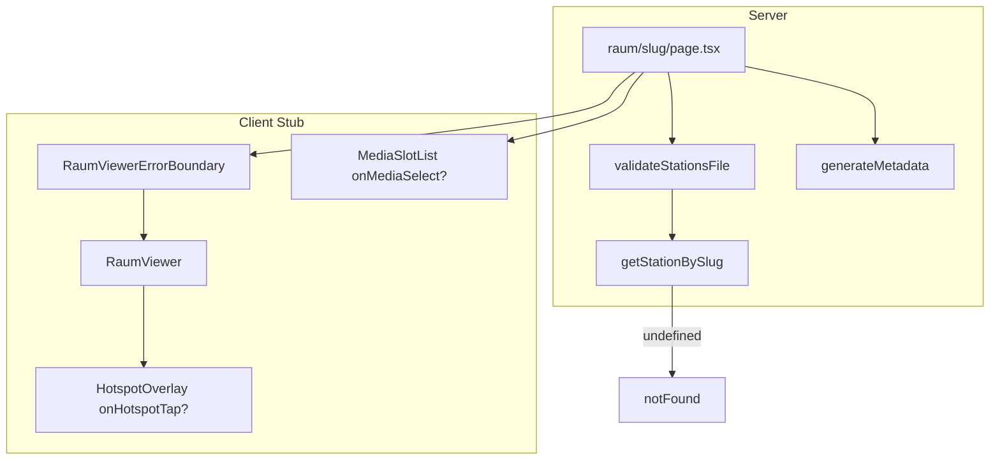

# Issue #13 — Platzhalter-Stationsseite

## Ziel und Abgrenzung

**Ziel:** [`app/app/raum/[slug]/page.tsx`](app/app/raum/[slug]/page.tsx) von der Minimalansicht zur **demo-tauglichen, gehärteten Stations-Shell** ausbauen — passend zu [issues-phase-1.md](dokumentation/github-project/issues-phase-1.md) und [ADR-006](dokumentation/adr/006-raum-viewer-gyro-hotspots.md).

**In Scope (#13):**
- `RaumViewer`-Stub (Layout + Hotspot-Marker, **Phase-2-ready Props**)
- Raumbild + Asset-Validierung
- `validateStationsFile()` beim JSON-Laden
- Demo-Station mit **echten** Platzhalter-Dateien unter `public/demo/`
- `MediaSlotList`, Metadata, A11y-Grundlagen, Error Boundary
- Mobile First (Hochformat)

**Explizit nicht (#13 → Phase 2 #55 / #18–#20):**
- `deviceorientation`, Gyro-Pan, Wischen
- Echte Tap→Medien-Panel-Logik (Callbacks bleiben No-Op)
- HTML5-Player, Autoplay, iOS-Orientierung



---

## Ausgangslage

| Artefakt | Status |
|----------|--------|
| Routing + SSG | [`page.tsx`](app/app/raum/[slug]/page.tsx) — `notFound()` bei unbekanntem Slug **bereits vorhanden** (im Plan als DoD bestätigen, nicht entfernen) |
| Typen + JSON | [`lib/types.ts`](app/lib/types.ts), [`data/stations.json`](app/data/stations.json) — Cast `as StationsFile`, **keine Validierung** |
| `public/stations/` | leer — `bild`-Pfade liefern 404 |
| QR-URLs | `/raum/[slug]` stabil ([ADR-002](dokumentation/adr/002-frontend-nextjs.md)) — **nicht ändern** |

---

## Härtung nach Plan-Review (Pflicht in #13)

### Kritisch — jetzt einbauen

| # | Maßnahme | Umsetzung |
|---|----------|-----------|
| 1 | **Phase-2-Props** | `onMediaSelect?: (medium: Medium) => void` auf `MediaSlot`; `onHotspotTap?: (hotspot: Hotspot) => void` auf `HotspotOverlay` / `RaumViewer`. Stub: nicht übergeben oder `undefined` — **keine** No-Op-Handler in Phase 1, damit keine falsche Interaktivität. Phase 2 verdrahtet Callbacks. |
| 2 | **`notFound()`** | Guard in `page.tsx` beibehalten: `if (!station) notFound()`. Akzeptanz: `/raum/ungültig` → 404. |
| 3 | **Datenvalidierung** | Neue [`lib/validate-stations.ts`](app/lib/validate-stations.ts): Pflichtfelder, Slug-Format (`kebab-case`), `typ`-Enum, `x`/`y` in 0–1, **`hotspot.mediumId` existiert in `station.medien`**, eindeutige `medium.id` / `hotspot.id`. `loadStations()` ruft Validierung auf; bei Fehler **throw** mit lesbarer Meldung (Build bricht ab). Kein neues npm-Paket (kein zod in #13). |
| 4 | **Bild-Pfad-Check** | Script [`scripts/validate-station-assets.mjs`](app/scripts/validate-station-assets.mjs) (oder `.ts` via `tsx`): für jedes `station.bild` → `public` + Pfad → `existsSync`. npm: `"validate:stations"`. **Vor Demo/Merge ausführen**; optional in `prebuild` hängen. Akzeptanz: alle 10 `bild`-Pfade existieren. |

### Mittel — in #13 mitnehmen

| # | Maßnahme | Umsetzung |
|---|----------|-----------|
| 5 | **Echte Demo-Assets** | Unter `public/demo/`: z. B. kurzes Platzhalter-Audio (CC0/silent wav), 1 kleines JPG für `foto`, 1 Text als `.txt` oder inline in JSON, Video: kurzer Platzhalter oder statisches Poster-JPG + Hinweis „Video folgt“. `musik`-`quelle` zeigt auf **existierende** Dateien. |
| 6 | **Barrel** | [`components/raum-viewer/index.ts`](app/components/raum-viewer/index.ts) re-exportiert `RaumViewer`, Typen der Props. |
| 7 | **Error Boundary** | [`components/raum-viewer/raum-viewer-error-boundary.tsx`](app/components/raum-viewer/raum-viewer-error-boundary.tsx) um `RaumViewer` in `page.tsx`; Fallback: statischer Platzhalter + Link zurück. Zusätzlich: `onError` auf `next/image` → interner Gradient-Fallback (kein Crash). |
| 8 | **A11y** | Viewer: `role="region"` + `aria-labelledby` (Titel-ID); Hotspots: `aria-label` aus `label` + Medium; Marker-Kontrast (z. B. Ring `ring-2 ring-white` auf dunklem Bild); Stub-Marker **nicht** fokussierbar (`tabIndex={-1}`) bis Phase 2. Akzeptanz: Screenreader liest Region → Titel → Medienliste sinnvoll. Skip-Link: **Phase 2** (#14 Startseite) — hier nur `#medien` Anker auf Stationsseite. |
| 9 | **Metadata** | `generateMetadata({ params })` in `page.tsx`: `title: station.titel`, `description` gekürzt aus `beschreibung`. OG optional minimal (`openGraph.title`). URL-Schema `/raum/[slug]` **frozen** (Kommentar in `architektur.md` oder Issue-Notiz). |

### Klein — mit abdecken

| # | Maßnahme | Umsetzung |
|---|----------|-----------|
| 10 | **Bild-Größe** | Nach Kopie: grobe Prüfung im Asset-Script (Warnung wenn Datei > 500 KB). Finale Optimierung #17/#27. |
| 11 | **Regression** | Kein Playwright in #13; `validate:stations` + `npm run build` als CI-tauglicher Mindest-Check. |
| 12 | **`puzzleSegmentId`** | Unsichtbar in DOM: `data-puzzle-segment={station.puzzleSegmentId}` am `<main>` — Platz für Phase-2-Hub ohne Layout-Refactor. |

---

## Komponenten-Architektur

| Datei | Rolle |
|-------|--------|
| [`components/raum-viewer/index.ts`](app/components/raum-viewer/index.ts) | Barrel-Re-Exports |
| [`components/raum-viewer/raum-viewer.tsx`](app/components/raum-viewer/raum-viewer.tsx) | Client; Props inkl. `onHotspotTap?` |
| [`components/raum-viewer/room-image-pane.tsx`](app/components/raum-viewer/room-image-pane.tsx) | Bild-Fenster + `onError`-Fallback |
| [`components/raum-viewer/hotspot-overlay.tsx`](app/components/raum-viewer/hotspot-overlay.tsx) | Marker; `onHotspotTap?` (unbenutzt in #13) |
| [`components/raum-viewer/static-room-fallback.tsx`](app/components/raum-viewer/static-room-fallback.tsx) | Ohne `bild` |
| [`components/raum-viewer/raum-viewer-error-boundary.tsx`](app/components/raum-viewer/raum-viewer-error-boundary.tsx) | Error Boundary |
| [`components/media-slot.tsx`](app/components/media-slot.tsx) | `onMediaSelect?: (medium: Medium) => void` |
| [`components/media-slot-list.tsx`](app/components/media-slot-list.tsx) | Liste + Empty-State |
| [`components/station-back-link.tsx`](app/components/station-back-link.tsx) | Zur Startseite |
| [`lib/validate-stations.ts`](app/lib/validate-stations.ts) | JSON-Validierung |
| [`lib/stations.ts`](app/lib/stations.ts) | `loadStations` + `getMediumById` |

**Props-Beispiel (Phase-2-ready):**

```ts
type MediaSlotProps = {
  medium: Medium
  onMediaSelect?: (medium: Medium) => void
}

type HotspotOverlayProps = {
  hotspots: Hotspot[]
  medien: Medium[]
  onHotspotTap?: (hotspot: Hotspot) => void
}
```

---

## Seitenlayout (Mobile First)

1. `StationBackLink` (min. 44px Tap-Target)
2. `RaumViewerErrorBoundary` → `RaumViewer` oder `StaticRoomFallback`
3. `h1` + Beschreibung (`id` für `aria-labelledby`)
4. `MediaSlotList` mit `id="medien"`
5. Kein Debug-`Slug`

**`schulsozialarbeit`:** ohne `bild`; **1×** Demo-`text`-Medium mit echter `quelle` unter `public/demo/`.

---

## Raumbilder (#13 vs. #17)

- 10 JPEGs nach [`zuordnung-stationen-bilder.md`](auftraggeber/material/stationen/zuordnung-stationen-bilder.md) → `public/stations/{slug}.jpg`
- `validate:stations` bestätigt Existenz
- Fehlendes Bild: komponenteninterner Fallback (Gradient + Titel), kein Seiten-Crash

---

## Daten / JSON (Pflicht: Demo-Station)

**Demo-Station `musik`:**

| Feld | Inhalt |
|------|--------|
| `medien` | 4 Einträge (`audio`, `video`, `foto`, `text`) — **`quelle` nur auf existierende Dateien** in `public/demo/` |
| `hotspots` | 2 Marker; `mediumId` referenziert gültige Demo-Medien (Validierung fängt Tippfehler ab) |

**Übrige 10 Stationen:** `medien: []` + Empty-State.

**`schulsozialarbeit`:** 1× `text`, kein `bild`, kein Hotspot-Overlay.

---

## Technische Details

- `next/image` für `/stations/*`; Demo-Assets ggf. ohne Image-Optimierung
- TypeScript strict, kein `any`
- Tailwind `zinc`-Palette wie bisher

---

## Akzeptanzkriterien (Definition of Done)

- [ ] `validateStationsFile()` — Build schlägt bei kaputtem JSON / invaliden Hotspot-Refs fehl
- [ ] `npm run validate:stations` — alle `bild`-Pfade existieren (10/10)
- [ ] `/raum/ungültig-slug` → **404** (`notFound`)
- [ ] `/raum/musik`: 4 Medien-Slots, 2 Hotspots, **Demo-Dateien erreichbar** (keine toten `quelle`)
- [ ] 10 Stationen mit Raumfoto; `schulsozialarbeit` statisch + 1 Text-Slot
- [ ] `generateMetadata`: Titel = Stationstitel
- [ ] `data-puzzle-segment` am `<main>` wenn `puzzleSegmentId` gesetzt
- [ ] Viewer-Region: `role="region"`, `aria-labelledby`; Hotspot-Kontrast sichtbar
- [ ] Error Boundary: simulierter Fehler in Dev bricht nicht ganze Page (optional manuell)
- [ ] Props `onMediaSelect?` / `onHotspotTap?` in Typen; Phase 1 ohne Handler
- [ ] 375px: kein horizontaler Scroll
- [ ] `npm run validate:stations && npm run build && npm run lint` grün
- [ ] Keine Gyro-/Player-Logik

---

## Reihenfolge der Umsetzung

1. `validate-stations.ts` + `loadStations()` anbinden
2. JSON: `musik` + `schulsozialarbeit` Demo-Daten
3. Assets: `public/stations/*` + `public/demo/*`
4. `scripts/validate-station-assets` + npm-Script
5. Komponenten inkl. Callback-Props, Barrel, Error Boundary
6. `page.tsx`: Metadata, Boundary, `data-puzzle-segment`, `#medien`
7. `validate:stations` + build + manuell `/raum/musik` + 404-Slug

---

## Anschluss Phase 2

[#55](dokumentation/github-project/issues-phase-2.md): `onHotspotTap` / `onMediaSelect` verdrahten, Gyro in `room-image-pane`, Player #18–#20.

[#14](dokumentation/github-project/issues-phase-1.md) Startseite: nutzt `puzzleSegmentId` aus JSON — DOM-Hook bereits gesetzt.

**URL-Stabilität:** Gedruckte QR-Codes (#15) hängen an `/raum/[slug]` — Slugs in JSON nicht umbenennen ohne Migration.
