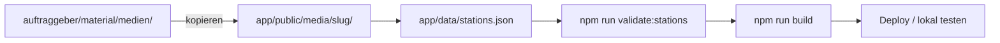

# Content manuell einpflegen

_Anleitung für MPZ/Lehrkräfte (MVP): Medien und Hotspots ohne Admin-Oberfläche — JSON + Dateien im Repo._

**Langfristig:** Directus (ADR-003, Phase 5). **Jetzt:** Dateien unter `app/public/` + Einträge in `app/data/stations.json`.

**Referenz-Station im Repo:** `klassenzimmer` — vier Medientypen, vier Hotspots, echte Dateien unter `app/public/media/klassenzimmer/`.

Verwandte Dokumente:

- [content-verzeichnisstruktur.md](../dokumentation/content-verzeichnisstruktur.md) — Slugs, Zonen, Pfadkonventionen
- [public/media/README.md](../app/public/media/README.md) — Kurzreferenz Ordnerstruktur
- [lokal-testen-und-anschauen.md](./lokal-testen-und-anschauen.md) — Test-Routen, Build-Check
- [fuer-entwickler.md](./fuer-entwickler.md) — Deploy, Git LFS, Coolify

---

## Überblick



| Schritt | Was | Wo |
|--------|-----|-----|
| 1 | Medien-Dateien ablegen | `app/public/media/{slug}/` |
| 2 | Optional: Raumbild | `app/public/stations/{slug}.jpg` |
| 3 | Station in JSON beschreiben | `app/data/stations.json` |
| 4 | Optional: Hotspots | gleiche Datei, Array `hotspots` |
| 5 | Prüfen & deployen | `validate:stations`, `build`, Push |

**Hotspots sind optional.** Ohne Hotspots erscheinen Medien in der **Liste unterhalb** des Raumbildes — Nutzer tippen „Tippen zum Abspielen“. Hotspots sind die gelben Punkte **im Panorama**.

---

## Voraussetzungen

- Terminal im Ordner **`app/`** (alle `npm`-Befehle dort)
- Slug der Station aus der [kanonischen Liste](../dokumentation/content-verzeichnisstruktur.md) — **nicht umbenennen** (QR-Codes sind gedruckt)
- Lokal testen: `npm run dev` → zuerst `/eintritt?t=heft-2026-27` (alle Räume sofort klickbar)

---

## Schritt 1 — Dateien ablegen

### Stations-Medien

```
app/public/media/{slug}/
├── audio/      MP3, WAV
├── video/      MP4 (ADR-004: Upload auf MPZ-Server)
├── fotos/      JPG, WebP
└── texte/      MD (Markdown) oder TXT (Plaintext)
```

**Beispiel `klassenzimmer`:**

```
app/public/media/klassenzimmer/
├── audio/grundschule_demo.mp3
├── video/grundschule_demo.mp4
├── fotos/grundschule_demo.jpg
└── texte/grundschule_demo.md
```

Rohmaterial liegt in `auftraggeber/material/medien/{slug}/`. Nach Freigabe **kopieren** nach `app/public/` — nicht aus dem Submodule zur Laufzeit laden ([build-kontext-submodule-regeln.md](../dokumentation/build-kontext-submodule-regeln.md)).

### Raumbild (Gyro-Panorama)

```
app/public/stations/{slug}.jpg
```

In JSON: `"bild": "/stations/{slug}.jpg"`. Panorama ideal ≥ 2,5 : 1 Breite; Details siehe [fuer-entwickler.md](./fuer-entwickler.md) (Abschnitt Raumbilder).

---

## Schritt 2 — `stations.json` bearbeiten

Datei: [`app/data/stations.json`](../app/data/stations.json). Pro Station ein Objekt im Array `stations`.

### Minimales Beispiel (nur Text, ohne Hotspots)

```json
{
  "slug": "werken",
  "titel": "Werkenzimmer",
  "beschreibung": "Kurzer Willkommenstext für die Stationsseite.",
  "bild": "/stations/werken.jpg",
  "medien": [
    {
      "id": "werken-info",
      "typ": "text",
      "quelle": "/media/werken/texte/willkommen.md",
      "untertitel": "Über unser Werken"
    }
  ]
}
```

### Vollständiges Beispiel (alle vier Typen + Hotspots)

Orientierung: Eintrag `klassenzimmer` in `stations.json` (Issue **#93**).

```json
"medien": [
  {
    "id": "demo-audio",
    "typ": "audio",
    "quelle": "/media/klassenzimmer/audio/grundschule_demo.mp3",
    "untertitel": "Mein Schultag (Audio)"
  },
  {
    "id": "demo-video",
    "typ": "video",
    "videoSource": "upload",
    "quelle": "/media/klassenzimmer/video/grundschule_demo.mp4",
    "poster": "/media/klassenzimmer/fotos/grundschule_demo.jpg",
    "untertitel": "Mein Schultag (Video)"
  },
  {
    "id": "demo-foto",
    "typ": "foto",
    "quelle": "/media/klassenzimmer/fotos/grundschule_demo.jpg",
    "untertitel": "Schulfoto"
  },
  {
    "id": "demo-text",
    "typ": "text",
    "quelle": "/media/klassenzimmer/texte/grundschule_demo.md",
    "untertitel": "Mein Schultag"
  }
],
"hotspots": [
  {
    "id": "hs-text",
    "label": "Korkpinnwand",
    "x": 0.22,
    "y": 0.45,
    "radius": 0.06,
    "mediumId": "demo-text"
  },
  {
    "id": "hs-video",
    "label": "Tafel",
    "x": 0.35,
    "y": 0.38,
    "radius": 0.06,
    "mediumId": "demo-video"
  },
  {
    "id": "hs-audio",
    "label": "Klassentische",
    "x": 0.52,
    "y": 0.55,
    "radius": 0.06,
    "mediumId": "demo-audio"
  },
  {
    "id": "hs-foto",
    "label": "Fensterseite",
    "x": 0.75,
    "y": 0.4,
    "radius": 0.06,
    "mediumId": "demo-foto"
  }
]
```

---

## Felder-Referenz

### `medien[]`

| Feld | Pflicht | Werte / Hinweis |
|------|---------|-----------------|
| `id` | ja | Eindeutig **pro Station** (z. B. `werken-audio`) |
| `typ` | ja | `audio` \| `video` \| `foto` \| `text` \| `link` \| `embed` ([ADR-017](../dokumentation/adr/017-externe-medien-hotspot-marker.md)) |
| `quelle` | ja | Pfad mit `/` unter `app/public/` — bei `link`/`embed`: `https://…` (nur Allowlist-Domains bei `embed`) |
| `untertitel` | nein | Anzeige in Medienliste und Panel |
| `thumbnail` | nein | Vorschaubild unter `/public/…` — Medienliste und Hotspot-Fallback ([ADR-017](../dokumentation/adr/017-externe-medien-hotspot-marker.md) Stufe 1) |
| `videoSource` | bei Video | `upload` (Standard) oder `youtube` (MVP: nur Hinweistext, kein Embed) |
| `poster` | nein | Nur bei `typ: video` — Vorschaubild-Pfad |
| `embedAllow` | bei `embed` | Optional; nur Subset von `delightex.com` (Code-Default) — verengen erlaubt, keine neuen Domains |

### Video-Modi (`videoSource`)

| Situation | `videoSource` | `quelle` | `poster` |
|-----------|---------------|----------|----------|
| Echtes MP4 | `upload` | `/media/…/video/datei.mp4` | optional JPG |
| Nur Plakat, noch kein Film | `upload` | `/media/…/fotos/plakat.jpg` | — |
| YouTube (inaktiv) | `youtube` | bare Video-ID, **ohne** `/` | — |

### `hotspots[]` (optional)

| Feld | Pflicht | Werte / Hinweis |
|------|---------|-----------------|
| `id` | ja | Eindeutig pro Station |
| `x`, `y` | ja | **0–1** (siehe unten) |
| `mediumId` | bei Medien-Hotspot | Muss zu `medien[].id` passen |
| `label` | nein | Anzeige / Barrierefreiheit |
| `radius` | nein | Trefferkreis für Medien-Hotspots; bei Dialog-Figuren irrelevant |
| `action` | nein | `dialog` nur für Maskottchen (`daz`, `pc-raum`) — siehe [ADR-011](../dokumentation/adr/011-dialog-mascot-hotspots.md) |
| `mascot` | bei Dialog | `frieda` \| `otto` |
| `mascotSize` | nein | Anteil der Panorama-Höhe (0,05–1); nur bei `action: "dialog"` — siehe [ADR-014](../dokumentation/adr/014-mascot-size-json.md) |
| `mascotFlipX` | nein | `true` = Figur horizontal gespiegelt (links↔rechts); Fußpunkt bleibt auf `(x, y)` |
| `icon` | nein | Pfad `/media/{slug}/icons/….svg` oder PNG — ersetzt gelben Punkt ([ADR-017](../dokumentation/adr/017-externe-medien-hotspot-marker.md) Stufe 1) |
| `iconSize` | nein | 0,05–0,25 — Anteil der Panorama-Höhe (wie `mascotSize`) |

**Dialog-Stationen** (`daz`, `pc-raum`): Audio läuft über `dialog.segmente[]` und `/api/dialog/…` — nicht über `typ: audio` in `medien[]`. Dort Hotspots mit `action: "dialog"`, `mascot: "frieda"` \| `"otto"` und optional `mascotSize` (Default im Code: `0.22`) sowie `mascotFlipX`.

### `hotspots360[]` (nur `viewer: "equirectangular"`, ADR-018)

Statt `x`/`y` gelten **Kugelkoordinaten** aus dem Equirectangular-Panorama:

| Feld | Pflicht | Werte / Hinweis |
|------|---------|-----------------|
| `id` | ja | Eindeutig pro Station |
| `yaw`, `pitch` | ja | Grad (−180…180 / −90…90); Ankerpunkt im Panorama |
| `mediumId` | bei Medien-Hotspot | Wie bei Flat |
| `action`, `mascot`, `mascotSize`, `mascotFlipX` | Dialog | Wie bei Flat |
| `bubblePitchOffset` | nein | Zusätzlicher Pitch (Grad) für Dialog-Bubble nach oben; nur Dialog |
| `icon`, `iconSize` | Medien | Wie bei Flat |

**Kalibrierung (Dev):** `npm run dev` → `/raum/{slug}?hotspot-calib=1` → auf Ankerpunkt klicken → JSON-Snippet kopieren. Maskottchen: **Fuß** anklicken; Medien: **Icon-Mitte**. Abnahme-Referenz: [`2026-06-13-sphere-hotspot-acceptance.md`](../dokumentation/projektmanagement/2026-06-13-sphere-hotspot-acceptance.md).

### `dialog` — Sprecherwechsel und Text (**heute pflegbar**)

Block `station.dialog` neben `hotspots[]` (Beispiel: `daz` in `stations.json`).

| Feld | Pflicht | Werte / Hinweis |
|------|---------|-----------------|
| `figuren` | ja | `["frieda", "otto"]` — erlaubte Figuren |
| `segmente[]` | ja | Playlist: ein Eintrag = ein Audio-Clip + Anzeigetext |
| `segmente[].id` | ja | Eindeutig pro Station |
| `segmente[].rolle` | ja | `frieda` \| `otto` \| `beide` — steuert Sprecher-Highlight und Schwanz der Blase (links/rechts/mitte) |
| `segmente[].text` | ja | Text in der Sprechblase (während dieses Clips) |
| `segmente[].quelle` | ja | `/api/dialog/{slug}/…wav` — Clips unter `app/content/dialog-audio/` |
| `segmente[].gruppe` | nein | Verweis auf `gruppen[].id` — mehrere kurze Clips, **eine** Blase (z. B. fünf Grüße) |
| `segmente[].tail` | nein | Optional `left` \| `right` \| `center` — überschreibt Schwanz aus `rolle` für dieses Segment |
| `gruppen[]` | nein | `{ "id", "text" }` — gemeinsamer Blasentext für gruppierte Segmente |

Audio-Workflow: [ADR-010](../dokumentation/adr/010-dialog-cutscene-gated-audio.md), Entwickler-Setup in [fuer-entwickler.md](./fuer-entwickler.md).

### `dialog.bubble` — Position und Größe ([ADR-015](../dokumentation/adr/015-dialog-bubble-json.md))

Optionaler Block; fehlt er, bleibt die Blase wie bisher (`max-w-md`, 15 px Schrift, Mitpan über [ADR-013](../dokumentation/adr/013-dialog-blase-mitpan.md)).

| Feld | Default (Code) | Semantik |
|------|----------------|----------|
| `bubble.y` | `0.12` | Vertikal in der Hero-**Box** (0 oben, 1 unten; Anteil `containerH`, nicht Bildhöhe) |
| `bubble.x` | *(fehlt)* | Optional; fehlt → Mitpan mit Maskottchen (ADR-013) |
| `bubble.maxWidth` | `0.88` | Max. Breite als Anteil der Hero-Breite (`containerW`) |
| `bubble.fontSize` | `~0.0375` | Schrift als Anteil der Hero-Box-Höhe (`containerH`; ≈ 15 px bei 400 px) |
| `bubble.followPan` | `true` | Bei gesetztem `x`: Gyro-Pan der Szene auf die Blase anwenden. `false` = viewport-fixe x |

**Hinweis:** Bei gesetztem `bubble.x` ersetzt `followPan` die ADR-013-Maskottchen-Zentrierung (reiner Pan-Delta, kein Doppelzählen). Werte nach JSON-Änderung: Seite neu laden.

---

## Schritt 3 — Hotspots platzieren

Es gibt **keinen visuellen Editor** im Repo. Koordinaten werden in JSON gesetzt und am Gerät nachjustiert.

### Koordinaten-System

- `x`: 0 = linker Rand, 1 = rechter Rand des **Quellbildes** (horizontal per Gyro/Wischen erreichbar)
- `y`: 0 = **oberer Rand des sichtbaren Ausschnitts**, 1 = **unterer Rand des sichtbaren Ausschnitts**
- `y` bezieht sich **nicht** auf das volle Quellbild — bei Zoom-Beschnitt oben/unten abgeschnitten. Mit `y: 1` sitzt der Anker am unteren Bildschirmrand (z. B. Maskottchen-Fußpunkt auf dem Boden im sichtbaren Raum).
- **`y` muss zwischen 0 und 1 bleiben** — Werte darüber führen zum Validator-Fehler (kein Crash mehr nötig).
- Der Marker sitzt **mittig** auf `(x, y)`; Maskottchen: Fußpunkt unten am Anker (`translate(-50%, -100%)`)

### Methode A — Schätzung und Nachjustieren

1. Startwerte in `stations.json` eintragen (z. B. `x: 0.5`, `y: 0.5`)
2. Bei Dialog-Figuren zusätzlich `mascotSize` setzen (Start: `0.22`; Schritte 0,02–0,05)
3. `npm run dev` → `/raum/{slug}` laden
4. Position und Größe prüfen, `x`/`y`/`mascotSize` anpassen, Seite neu laden
5. Auf dem **Handy** testen (Gyro verschiebt den sichtbaren Ausschnitt; Hero-Layout wie Produktion)

### Methode B — Klick-Koordinaten im Browser (Desktop)

1. Raumseite öffnen, Entwicklertools (F12) → Konsole
2. Snippet einfügen und auf dem Raumbild klicken:

```javascript
// Klick auf das sichtbare Raumbild (Gyro-Viewer)
const layer = document.querySelector('.will-change-transform')
if (!layer) {
  console.warn('Raum-Viewer nicht geladen — Seite mit bild öffnen und warten bis Bild da ist')
} else {
  layer.addEventListener('click', (e) => {
    const r = layer.getBoundingClientRect()
    const x = ((e.clientX - r.left) / r.width).toFixed(3)
    const y = ((e.clientY - r.top) / r.height).toFixed(3)
    console.log(`x: ${x}, y: ${y}  (y = sichtbarer Ausschnitt, 0 oben / 1 unten)`)
  })
  console.log('Auf das Raumbild klicken — x/y für stations.json (y viewport-relative).')
}
```

3. Ausgegebene Werte in `stations.json` übernehmen

### Methode C — Erst ohne Hotspots

Nur `medien[]` pflegen, Wiedergabe über die **Medienliste** testen. Hotspots später ergänzen.

### Debug-Hinweis

`?debug=1` an der URL (z. B. `/raum/werken?debug=1`) zeigt Gyro-HUD — hilft beim Verständnis des Pans, ersetzt aber keinen Hotspot-Editor.

Bei riskantem `y` warnt `npm run validate:stations` (Heuristik) bzw. die Browser-Konsole zur Laufzeit.

---

## Schritt 4 — Prüfen

Im Ordner `app/`:

```bash
npm run validate:stations
npm run test
npm run build
```

`validate:stations` prüft:

- jede `quelle` und jedes `bild` existiert unter `public/` (oder `content/` bei Dialog-Audio)
- JSON-Schema (Slugs, doppelte IDs, `mediumId` verweist auf bekannte Medien)
- bei JPEG: keine LFS-Pointer als „Bild“

### Manuell im Browser

| Route | Prüfen |
|-------|--------|
| `/eintritt?t=heft-2026-27` | Cookie setzen |
| `/raum/{slug}` | Medienliste: alle Typen abspielbar |
| `/raum/{slug}` | Hotspots: Tipp öffnet dasselbe Panel |
| Handy + HTTPS | Gyro, Hotspot erreichbar nach Wischen |

Referenz: [`/raum/klassenzimmer`](https://schulnavigator.mpz.schule/raum/klassenzimmer) (Prod) bzw. lokal.

---

## Checkliste pro Station

Kopieren und abhaken:

```
Station: _____________  Slug: _____________

[ ] Rohmaterial in auftraggeber/material/medien/{slug}/ (oder von Schule erhalten)
[ ] Dateien nach app/public/media/{slug}/ kopiert
[ ] Raumbild app/public/stations/{slug}.jpg (falls Gyro gewünscht)
[ ] stations.json: beschreibung + medien[] eingetragen
[ ] Jede medien[].id eindeutig; quelle-Pfade mit / beginnen
[ ] Optional: hotspots[] mit passendem mediumId
[ ] npm run validate:stations — grün
[ ] npm run build — grün
[ ] Manuell /raum/{slug} (Desktop + Handy)
[ ] git commit + push → Coolify-Deploy abwarten
```

---

## Häufige Fehler

| Symptom | Ursache | Lösung |
|---------|---------|--------|
| Build bricht ab | Datei in `quelle` fehlt | Pfad prüfen, Datei unter `app/public/` legen |
| Build: LFS-Pointer | JPEG nicht ausgecheckt | `git lfs pull` lokal; Coolify LFS aktiv |
| Hotspot „trifft nicht“ | falsches `x`/`y` oder `y` außerhalb sichtbarem Bereich | Nachjustieren; `y` ins mittlere Drittel |
| Video zeigt nur Bild | `quelle` zeigt auf JPG, kein MP4 | Absicht (Poster-only) oder MP4-Pfad setzen |
| Text öffnet externen Link | alte `media-player`-Version | `typ: text` nutzt `TextViewer` inline (#93) |
| `poster`-Fehler im Validator | `poster` bei `typ: audio` o. ä. | `poster` nur bei `typ: video` |

---

## Hotspot-Icons, Links und Delightex-Embed (ADR-017, live)

**Stufe 1:** Medien-Hotspots zeigen `icon` → `thumbnail` → Typ-Preset → gelber Punkt.

**Stufe 2:** `typ: link` — öffnet externen Tab.

**Stufe 3:** `typ: embed` — Delightex im Medien-Panel (`iframe`). Beispiel: `pc-raum` / `pc-delightex`. Öffentliche Embed-URL von Delightex; Button „Im Browser öffnen“ ist immer verfügbar.

**Delightex-Fallback (automatisch):** Bei `delightex.com`-URLs erkennt die App das Gerät automatisch. Auf Smartphones und Tablets wird kein iframe angezeigt — stattdessen erscheint eine Fallback-Karte mit „Im Browser öffnen“ und einem Link zur Delightex-App (App Store / Play Store). Auf dem Desktop bleibt das iframe erhalten. Keine Redaktionsänderung nötig — die Share-URL aus Delightex reicht.

| Stufe | Inhalt | Redaktion |
|-------|--------|-----------|
| 1 | Icons statt gelber Punkt | **live** |
| 2 | `typ: link` | **live** |
| 3 | `typ: embed` | **live** — `https://…` auf `delightex.com`; DSB-Freigabe vorausgesetzt |

Umsetzungsplan: [`dokumentation/projektmanagement/2026-06-10-externe-medien-hotspot-marker-plan.md`](../dokumentation/projektmanagement/2026-06-10-externe-medien-hotspot-marker-plan.md)

---

## Was bewusst nicht in dieser Anleitung steht

- **Dialog-Audio-Dateien kopieren / API-Route** — siehe Abschnitt `dialog` oben, [ADR-010](../dokumentation/adr/010-dialog-cutscene-gated-audio.md) und [fuer-entwickler.md](./fuer-entwickler.md)
- **Directus** / Admin-Oberfläche — Phase 5
- **YouTube-Embed** — ADR-004, rechtlich offen
- **QR-Druck** — [qr-codes-drucken.md](./qr-codes-drucken.md)

---

## Demo durch echten Content ersetzen

Stationen wie `musik` verweisen noch auf `/demo/…`. Umstellung:

1. Echte Dateien nach `app/public/media/musik/` legen
2. In `stations.json` Pfade von `/demo/…` auf `/media/musik/…` ändern
3. `validate:stations` + manueller Test
4. Ungenutzte `/demo/…`-Referenzen in anderen Stationen prüfen, bevor Demo-Dateien gelöscht werden
