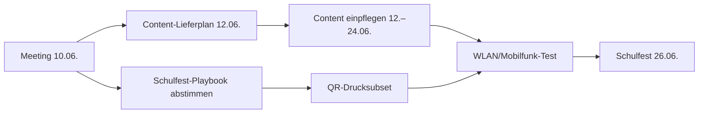

# Meeting-Fahrplan — 10.06.2026

**Anlass:** MPZ × Schule (Sten/Tina) — Demo der App-Shell + Abstimmung Content & Schulfest  
**Issue:** [#25](https://github.com/flxln/schulnavigator/issues/25)  
**Ziel:** Verbindlichen **Content-Lieferplan** und Klarheit zum **Schulfest-Setup** (26.06.) — ohne beides startet Phase 3 nicht.

**Teilnehmer (geplant):** Felix (MPZ), Sten/Tina (Schule), ggf. Julia (MPZ)  
**Dauer:** ca. 45–60 Min. (Demo ~15 Min., Abstimmung ~30 Min., Puffer)  
**Technik:** iPhone mit Mobilfunk, Lautstärke an; App unter `https://schulnavigator.mpz.schule` (HTTPS)

**Demo-Ablauf (Detail):** [`demo-meeting-2026-06-10.md`](./demo-meeting-2026-06-10.md)

---

## Zeitplan

| Zeit | Block | Ergebnis |
|------|-------|----------|
| 0:00 | **Begrüßung & Stand** | Alle wissen: App-Shell ist fertig, Content fehlt noch |
| 0:05 | **Live-Demo** | Schule hat den Ziel-Workflow gesehen |
| 0:20 | **Was die App kann / was die Schule liefert** | Rollen klar |
| 0:30 | **Content-Lieferplan** (Tabelle ausfüllen) | Raum → Format → Klasse → Verantwortlich → Termin |
| 0:40 | **Schulfest vs. Tag der offenen Tür** | QR-Strategie grob verständlich |
| 0:50 | **Offene Punkte** (Fotos, WLAN, AVV, Projekttag) | To-dos mit Datum |
| 0:55 | **Nächste Schritte & Termine** | Nächstes Treffen / Deadline 12.06. |

---

## Block 1 — Live-Demo (ca. 15 Min.)

**Einstieg:** `/eintritt?t=fest-2026` (Schulfest-Modus — Räume erst nach Scan frei)

| # | Route | Zeigen |
|---|-------|--------|
| 1 | `/` nach Eintritt | Isometrischer Hub, Fortschritt „0 von 11“, gesperrte Fenster |
| 2 | `/scan` | Raum-QR scannen → Fenster freigeschaltet |
| 3 | `/raum/musik` | Gyro, Hotspots, **vier Medientypen** (Audio/Video/Foto/Text) — Technik-Demo |
| 4 | `/raum/daz`, `/raum/pc-raum` | Maskottchen antippen → Dialog mit Sprechblase |
| 5 | `/raum/klassenzimmer` | **Zielbild:** 4 echte Medien + Hotspots — so soll jede Station aussehen (#93) |
| 6 | beliebiger leerer Raum | Gleiche Shell, leere Slots — „hier kommt euer Content hin“ |

**Optional:** `heft-2026-27` kurz zeigen (alle Räume sofort klickbar, für Heft-Nutzung).

**Botschaft in einem Satz:**  
*Die App ist bereit — wir brauchen von euch die Inhalte (Texte, Ton, Bilder, Video) und wissen, welche Klasse welchen Raum macht.*

---

## Block 2 — Rollen & Lieferobjekte

### MPZ (Felix/Julia)

- App betreiben, Content technisch einpflegen (`stations.json` + Dateien)
- Hotspots im Panorama setzen (Koordinaten — MPZ oder mit Lehrkraft am Gerät)
- QR-Codes generieren und Druckvorlagen liefern
- Qualitätscheck (Länge, Ton, Lesbarkeit)
- Technischer Support am Schulfest

### Schule (Sten/Tina / Klassen)

- **Idee und Text** pro Station (Schule entscheidet *was* erzählt wird)
- Aufnahmen durch Kinder (Audio/Video) — **nur mit Einwilligung**
- Fehlende **Raumbilder** nachliefern (siehe Block 4)
- **Schulfest-Playbook** mit abstimmen: welche Räume physisch offen, welche nur per Hof-QR
- AVV unterschreiben (#43)
- Projekttag 24./25.06.: Kinder vor Ort, MPZ unterstützt Einpflege

### Was die App heute schon kann (kein Warten nötig)

- Entry-Token (`fest` / `heft`), Scanner, Hub-Freischaltung
- Gyro-Raumviewer, Hotspots, Medien-Panel
- Audio-, Video-, Foto-, Text-Player (Markdown inline)
- Dialog-Stationen (DaZ, PC-Raum) als Referenz

---

## Block 3 — Content-Lieferplan (Hauptbeschluss)

**Deadline für ausgefüllte Tabelle: 12.06.2026** — harte Voraussetzung für Phase 3 (Einpflege 12.–24.06.).

Pro Zeile festhalten:

| Raum (Slug) | Medienformat(e) | Klasse / AG | Verantwortlich | Liefertermin | Notizen |
|-------------|-----------------|-------------|----------------|--------------|---------|
| `klassenzimmer` | | | | | Demo vorhanden — echter Content? |
| `daz` | Dialog ✓ | | | | Dialog schon eingepflegt |
| `pc-raum` | Dialog ✓ | | | | Dialog schon eingepflegt |
| `werken` | | | | | |
| `turnhalle` | | | | | |
| `speiseraum` | | | | | |
| `kunst` | | | | | **Foto fehlt noch** |
| `lesewelt` | | | | | |
| `hort` | | | | | **Foto fehlt noch** |
| `musik` | | | | | Nur Demo-Medien |
| `schulsozialarbeit` | | | | | **Raumbild fehlt** |

**Klärungen pro Station:**

- Welche Formate? (Audio / Video max. ~60 s / Foto / Text)
- Wer schreibt den Text, wer nimmt auf?
- Reicht Material vom **Projekttag 24./25.06.**, oder brauchen wir Vorab-Lieferung?
- Braucht der Raum **Hotspots** im Bild (empfohlen: 1–4 Stück)?

**Referenz-Workflow:** [`klassenzimmer`](../app/data/stations.json) — Medien unter `public/media/klassenzimmer/`, Hotspots in JSON. Anleitung: [`content-einpflegen.md`](./content-einpflegen.md).

---

## Block 4 — Schulfest 26.06. (QR-Strategie)

*Aus Gespräch 03.06. — Details: [`issues-schulfest-gs39-nachtrag.md`](../dokumentation/github-project/issues-schulfest-gs39-nachtrag.md)*

**Nicht** pauschal 11× Tür-QR drucken. Stattdessen abstimmen:

1. **Welche Räume sind am Schulfest physisch offen?** (z. B. Turnhalle, Hof, Speiseraum, Werken, Mediathek …)
2. **Welche Stationen nur „virtuell“** — QR auf dem **Schulhof** (Schild/Baum), gleicher Link `/raum/[slug]`, ohne Raum betreten?
3. **Entry-QR** am Eingang — Modus `fest` (ein Scan am Eingang, dann Raum-QRs für Freischaltung)
4. **Content-Priorität:** Nur Räume mit **freigegebener Idee** bekommen MPZ-Umsetzung — keine gemeinsame Ideenfindung unter Zeitdruck

**Zu dokumentieren nach dem Meeting (MPZ):** Schulfest-Playbook (#87) → Schule freigeben (#90) → Drucksubset (#89).

**Frage an die Schule:** Passt das schmale Setup (~5 offene Räume + Hof-Virtualisierung) — oder andere Erwartung?

---

## Block 5 — Offene technische / organisatorische Punkte

| Thema | Stand | Beschluss / To-do | Bis wann |
|-------|-------|-------------------|----------|
| **Raumbilder** (#17) | 8/11 Panorama eingepflegt | `kunst`, `hort`: Pano nachliefern; `schulsozialarbeit`: HD-Foto | |
| **WLAN / Mobilfunk** (#26, #91) | ungeklärt | Test an Turnhalle + Schulhof mit echtem Handy; Mobilfunk = primär | vor 24.06. |
| **AVV** (#43) | Entwurf versendet | Unterschrift vor Schulfest? | |
| **Projekttag** 24./25.06. (#37) | geplant | MPZ vor Ort? Einverständniserklärungen am Tag? | |
| **Hub-Slot Eingangstür** (`ground-mid`) | vorläufig `klassenzimmer` | Finale Zuordnung mit Schule | optional |
| **Tablet-Fallback** (#41) | offen | 1–2 Tablets mit App — wer betreut? | vor 26.06. |

---

## Block 6 — Fahrplan nach dem Meeting (gemeinsam)

### Bis 12.06. (Phase 2 abschließen)

- [ ] **Schule:** Content-Lieferplan-Tabelle ausgefüllt zurück
- [ ] **Schule:** Fehlende Fotos (`kunst`, `hort`, `schulsozialarbeit`) — Liefertermin
- [ ] **MPZ:** Meeting-Protokoll + Playbook-Entwurf (#87)
- [ ] **Gemeinsam:** Schulfest-Raumliste (offen vs. Hof-QR) schriftlich fixiert

### 12.–22.06. (Phase 3)

- [ ] Content-Dateien von Schule an MPZ (spätestens **22.06.**)
- [ ] MPZ: Station für Station einpflegen (Vorbild `klassenzimmer`)
- [ ] Hotspots setzen, `npm run build` grün

### 24./25.06.

- [ ] Projekttag in der Schule — Aufnahmen, letzte Lücken, Live-Test

### 26.06.

- [ ] Schulfest live — Entry-QR, Raum-/Hof-QRs, Ansprechperson MPZ

---

## Was bewusst nicht Thema des Meetings ist

- Tablet-Layout (#74–#78) — nice-to-have, nicht Schulfest-kritisch
- i18n / Englisch-Menü (#24) — nach dem Fest
- Directus / Admin (#47) — Phase 5
- YouTube-Embed — rechtlich offen (ADR-004); Delightex-`embed` technisch live (ADR-017), Datenschutzerklärung-Absatz offen

---

## Checkliste Felix (vor dem Termin)

- [ ] `npm run build` auf Prod-Stand geprüft (Coolify nach letztem Push)
- [ ] Demo-Routen auf dem eigenen Handy durchgetestet ([`demo-meeting-2026-06-10.md`](./demo-meeting-2026-06-10.md))
- [ ] Ausdruck oder Bildschirm: **leere Content-Lieferplan-Tabelle** (Block 3) zum Ausfüllen
- [ ] QR `fest-2026` oder Link bereit
- [ ] Optional: Ausdruck Raum-QR `musik` oder `klassenzimmer` zum Live-Scan

## Checkliste Felix (nach dem Termin)

- [ ] Protokoll an Sten/Tina (kurz: Beschlüsse + To-dos + Termine)
- [ ] Content-Lieferplan in Repo oder Issue #25 kommentieren
- [ ] GitHub #25 schließen, wenn Lieferplan steht
- [ ] Folge-Issues #86–#91 aus Nachtrag-Doku anstoßen

---

*Stand App: Medien-Player #18–#20, TextViewer + Demo `klassenzimmer` #93, 8/11 Panorama-Raumbilder #27.*
