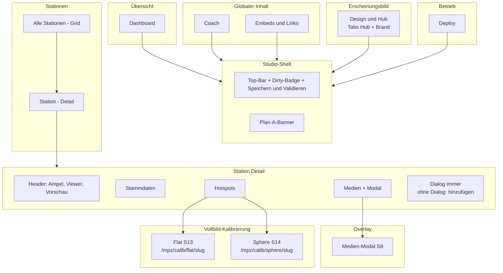

# MPZ Studio — Navigation Soll (verbindlich)

**Datum:** 2026-06-22  
**Status:** ✅ verbindlich (Design-Freeze IA, Issue [#196](https://github.com/flxln/schulnavigator/issues/196))  
**Implementierung:** Issues [#197](https://github.com/flxln/schulnavigator/issues/197)–[#204](https://github.com/flxln/schulnavigator/issues/204)

Verwandte Entscheidungen:

- [15-dialog-segment-zeilenmodell.md](./15-dialog-segment-zeilenmodell.md)
- [16-sphere-calib-screen.md](./16-sphere-calib-screen.md)
- [17-komponenteninventar-soll.md](./17-komponenteninventar-soll.md)
- [ROADMAP.md](./ROADMAP.md) — Zeitplan und Phase 4

**Offen (nicht IA):** ~~High-Fidelity-Mockups~~ — Stitch-HTML unter [`mockups/`](./mockups/) (2026-06-22, bekannt inkonsistent; Abnahme #196). Verbindlich bleiben diese Datei + [`mockups/SCREEN-MATRIX.md`](./mockups/SCREEN-MATRIX.md).

---

## Sidebar — Soll-Struktur

Vier Gruppen, **sechs Nav-Einträge** (ohne Dialog-Audio, ohne globalen Medien-Upload):

| Gruppe | Eintrag | Route |
|--------|---------|-------|
| **Übersicht** | Dashboard | `/mpz/studio` |
| **Stationen** | Alle Stationen | `/mpz/studio/stationen` |
| **Globaler Inhalt** | Coach | `/mpz/studio/coach` |
| | Embeds & Links | `/mpz/studio/embeds` |
| **Erscheinungsbild** | Design & Hub | `/mpz/studio/design` |
| **Betrieb** | Deploy | `/mpz/studio/deploy` |

**Station Detail** ist kein Sidebar-Punkt — Einstieg nur über Grid oder Direkt-URL.

**Design & Hub:** Container mit Tabs `hub` | `brand` per Query-Parameter:

- `/mpz/studio/design` → Default-Tab `hub`
- `/mpz/studio/design?tab=hub` → Hub-Karte (S19)
- `/mpz/studio/design?tab=brand` → Brand & Design (S20)

---

## Navigation — Soll (Mermaid)

Ziel: max. 2 Ebenen, Domänen gruppiert. Dialog-Audio nur im Tab Dialog (Segment-Zeile).



---

## Änderungen Ist → Soll

| Thema | Ist (Code heute) | Soll |
|-------|------------------|------|
| Sidebar | 9 flache Punkte (`studio-shell.tsx`) | 4 Gruppen, 6 Einträge |
| Dialog-Audio | global `/dialog-audio` + Tab `dialog-audio` + Badge in Dialog | nur Segment-Zeile im Tab Dialog |
| Medien hochladen | Sidebar-Button + Tab + `/ingest` | nur Tab Medien → Modal S9 |
| Brand / Hub | `/hub` und `/brand` getrennt | `/mpz/studio/design` mit Tabs |
| Dialog-Tab | nur bei `hasDialog` | immer + „Dialog hinzufügen“ |
| Dialog-Editor Sub-IA | flache Formulare | Gruppen/Bubble einklappbar unter Segment-Tabelle |
| Sphere-Kalibrierung | `/raum/{slug}?hotspot-calib=1` | `/mpz/calib/sphere/{slug}` |
| Vorschau | Link im Header | unverändert |

---

## Navigations-Matrix (Routen)

| Route | Ist-Nav | Soll-Nav | Screen | Anmerkung |
|-------|---------|----------|--------|-----------|
| `/mpz/studio` | Dashboard | Übersicht → Dashboard | S4 | |
| `/mpz/studio/stationen` | Stationen | Stationen → Grid | S5 | |
| `/mpz/studio/stationen/[slug]` | — | Stationen → Detail | S6 | |
| `/mpz/studio/stationen/[slug]?tab=stammdaten` | Tab | Stammdaten | S7 | |
| `/mpz/studio/stationen/[slug]?tab=medien` | Tab | Medien | S8 | öffnet Modal S9 |
| `/mpz/studio/stationen/[slug]?tab=hotspots` | Tab | Hotspots | S11 | Links zu S13/S14 |
| `/mpz/studio/stationen/[slug]?tab=dialog` | nur wenn Dialog | Dialog | S15 | immer sichtbar |
| `/mpz/studio/coach` | Coach | Global → Coach | S17 | |
| `/mpz/studio/embeds` | Embeds | Global → Embeds | S18 | |
| `/mpz/studio/design` | — | Erscheinungsbild → Design & Hub | S19/S20 | Tabs per `?tab=` |
| `/mpz/studio/deploy` | Deploy | Betrieb → Deploy | S21 | |
| `/mpz/calib/flat/[slug]` | von Hotspots | von Hotspots (flat) | S13 | unverändert |
| `/mpz/calib/sphere/[slug]` | — (Ist: Besucher-App) | von Hotspots (360°) | S14 | neu #201 |
| Modal Medien S9 | Sidebar + Tab + ingest | nur Tab Medien | S9 | |
| `/mpz/unlock` | Zugang | Zugang | S24 | optional im Paket |

### Entfallende Routen / Tabs

| Route / Tab | Soll-Verhalten | Issue |
|-------------|----------------|-------|
| `/mpz/studio/dialog-audio` | Redirect → `/mpz/studio/stationen` | #198 |
| `/mpz/studio/ingest` | Redirect → `/mpz/studio/stationen` | #198 |
| `/mpz/studio/hub` | Redirect → `/mpz/studio/design?tab=hub` | #197 |
| `/mpz/studio/brand` | Redirect → `/mpz/studio/design?tab=brand` | #197 |
| `?tab=dialog-audio` | Redirect → `?tab=dialog` | #198 |

---

## Station Detail — Tabs (Soll)

| Tab | Query | Sichtbarkeit | Besonderheiten |
|-----|-------|--------------|----------------|
| Stammdaten | `tab=stammdaten` (Default) | immer | S7 |
| Medien | `tab=medien` | immer | CTA öffnet Modal S9 |
| Hotspots | `tab=hotspots` | immer | Kalibrier-Links intern |
| Dialog | `tab=dialog` | **immer** | ohne Dialog: Empty + CTA; mit Dialog: Segment-Zeile |

**Entfällt:** Tab `dialog-audio`.

Dialog-Segment-Zeile (S15): Text + Audio (Upload, Abspielen, Löschen) in einer Zeile; Audio-UI als **aufklappbare Sub-Zeile** oder Popover pro Segment (Pre-Mortem 1a #2).

Dialog-Sub-Bereiche unter Segment-Tabelle (einklappbar, kein Sub-Tab):

1. Figuren
2. Segment-Tabelle (Hauptbereich)
3. Gruppen
4. Sprechblasen-Layout (`bubble`)

---

## Redirect-Implementierung (#197 / #198)

In `next.config` (oder Middleware) festhalten:

```
/mpz/studio/hub      → /mpz/studio/design?tab=hub
/mpz/studio/brand    → /mpz/studio/design?tab=brand
/mpz/studio/dialog-audio → /mpz/studio/stationen
/mpz/studio/ingest   → /mpz/studio/stationen
```

Sidebar Active-State (`pathname.startsWith`): `/mpz/studio/design` für Design & Hub; nicht mehr getrennt `/hub` / `/brand`.

---

## Abnahme-Regeln (IA)

| ID | Regel |
|----|-------|
| NAV-01 | Sidebar-Soll: 4 Gruppen, 6 Einträge |
| NAV-02 | Jede Route in Matrix hat Screen-ID |
| NAV-03 | Kein globaler Dialog-Audio-Nav oder Tab `dialog-audio` |
| NAV-04 | Medien-Modal nur von Tab Medien |
| NAV-05 | S14 primär `/mpz/calib/sphere/[slug]` |
| NAV-06 | Tab Dialog bei Station ohne `dialog` (Empty-State) |
| NAV-07 | Design & Hub: eine Route, zwei Tabs |

---

## Anhang — Implementierungs-Hinweise (nicht #196)

| Thema | Issue | Hinweis |
|-------|-------|---------|
| Dialog anlegen | #199 | `POST /api/mpz/stations/[slug]/dialog` — minimaler Block `{ figuren:['frieda','otto'], segmente:[] }` |
| Sphere-Links | #201 | `station-hotspots-table.tsx`: `target="_blank"` für `isSphere` entfernen |
| JSON-Schema Hotspot-Diskriminierung | DX-To-Do | `04-stations-schema.json` `if/then` — kein IA-Blocker |
| Legacy Sphere | optional | `/raum/{slug}?hotspot-calib=1` als Fallback bis Entfernung |

---

## Changelog

| Datum | Änderung |
|-------|----------|
| 2026-06-22 | Mockups Stitch-HTML + SCREEN-MATRIX; #196 abgeschlossen (Post-Mortem) |
