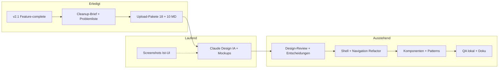
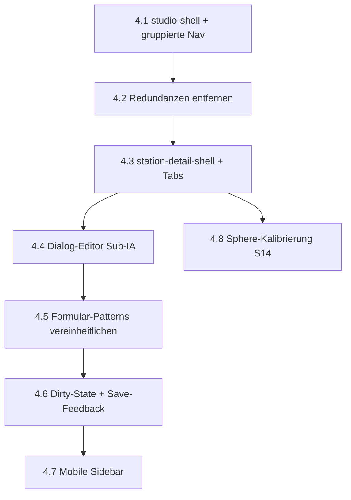
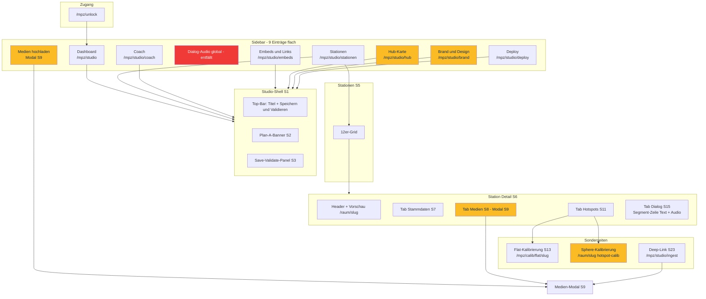
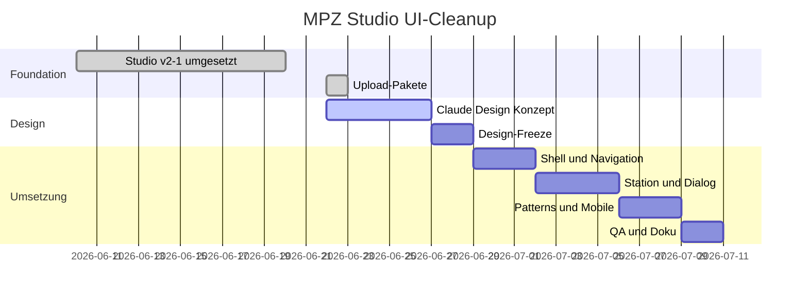

# MPZ Studio UI-Cleanup — Roadmap

**Stand:** 2026-06-22  
**Ziel:** Übersichtliche, funktionale Studio-Oberfläche bei voller v2.1-Funktionsabdeckung  
**Basis:** Funktionierendes Studio (Epic v0–v2.1) · Upload-Pakete für Claude Design bereit

Verwandte Artefakte:

- [Upload-Paket (vollständig)](./README.md)
- [Upload-Paket (10 MD)](../mpz-studio-claude-design-10md/01-ANLEITUNG-UND-PROMPT.md)
- [Ist-Probleme](./08-bekannte-ui-probleme.md)
- [Screen-Inventar](./02-screens-v2.1-und-user-stories.md)

---

## Gesamtfortschritt

| Phase | Status | Ergebnis |
|-------|--------|----------|
| **0 — Foundation** | ✅ abgeschlossen | Studio v2.1 live in `app/components/mpz-studio/` |
| **1 — Design-Briefing** | ✅ abgeschlossen | `00-cleanup-brief`, `08-bekannte-ui-probleme`, Screen-Inventar S1–S24 |
| **2 — Claude Design** | ✅ abgeschlossen | Stitch-HTML [`mockups/`](./mockups/) (52 Screens, bekannt inkonsistent) |
| **3 — Design-Freeze** | ✅ abgeschlossen | [`NAVIGATION-SOLL.md`](./NAVIGATION-SOLL.md) + [#196](https://github.com/flxln/schulnavigator/issues/196) |
| **4 — Implementierung** | 🔄 begonnen | #197 Shell ✅; #198 Redundanzen ✅; #199–#204 offen |
| **5 — Abnahme** | ⏳ offen | Manuelle Tests, `npm run build`, Kurz-Doku |

---

## Phase 2–5 im Detail

### Phase 2 — Claude Design (laufend)

| # | Aufgabe | Status | Artefakt |
|---|---------|--------|----------|
| 2.1 | Upload-Paket (10 MD) | ✅ | `mpz-studio-claude-design-10md/` |
| 2.2 | Screenshots Ist-UI | 🔄 optional | PNG laut `10-SCREENSHOTS.md` |
| 2.3 | Prompt + Konzept-Generierung | 🔄 | Claude Design Ausgabe |
| 2.4 | Mockups S1–S22 | ✅ | Stitch-HTML + [`SCREEN-MATRIX.md`](./mockups/SCREEN-MATRIX.md); S8 empty fehlt |

**Exit-Kriterium:** Lieferformat aus `00-cleanup-brief.md` vollständig (IA, Lösungen, Komponenten, Flows, Mockups).

### Phase 3 — Design-Freeze

| # | Entscheidung | Offen seit |
|---|--------------|------------|
| 3.1 | Dialog-Audio: nur in Segment-Zeile, kein globaler Nav/Tab | ✅ [`15-dialog-segment-zeilenmodell.md`](./15-dialog-segment-zeilenmodell.md) |
| 3.2 | Medien-Upload: Modal vs. Seite | ✅ **Modal** — Einstieg nur aus Tab Medien; `/ingest`-Deep-Link + Sidebar-Eintrag entfallen (Redirect → Stationen) ¹ |
| 3.3 | Dialog-Editor: Sub-Bereiche Gruppen/Bubble unter Segment-Tabelle | ✅ **Untereinander** als einklappbare Bereiche unter der Segment-Tabelle, kein eigener Sub-Tab ² |
| 3.4 | Tab Dialog bei allen Stationen + „Dialog hinzufügen“ | ✅ [`15-dialog-segment-zeilenmodell.md`](./15-dialog-segment-zeilenmodell.md) — **Achtung: Feature, kein Refactor** (Create-Pfad fehlt, siehe Phase 4.3) ³ |
| 3.5 | Brand + Hub: zusammenlegen oder getrennt lassen | ✅ **Zusammenlegen** → neue Route `/mpz/studio/design` (Tabs Hub + Brand), Redirects für `/hub` + `/brand` ⁴ |
| 3.6 | Sphere-Kalibrierung: eigener MPZ-Screen (Option A) | ✅ [`16-sphere-calib-screen.md`](./16-sphere-calib-screen.md) |
| 3.7 | Sidebar-Gruppen (finale Benennung) | ✅ **Default** = Gruppen der Soll-Navigation (Übersicht · Stationen · Globaler Inhalt · Erscheinungsbild · Betrieb); Feinschliff Claude Design ⁵ |

**Exit-Kriterium:** ✅ [`NAVIGATION-SOLL.md`](./NAVIGATION-SOLL.md) + Mockup-Abnahme [#196](../../../reviews/post-mortem-196-2026-06-22.md) (Mockups nutzbar, nicht pixel-homogen).

### Phase 4 — Implementierung (geschätzte Reihenfolge)

| # | Scope | Dateien (Schwerpunkt) |
|---|-------|------------------------|
| 4.1 | Sidebar-Gruppen, Top-Bar | `studio-shell.tsx` |
| 4.2 | Dialog-Audio aus Sidebar/Tab entfernen; Upload/Play in Segment-Zeile | `studio-shell`, `station-detail-shell`, `station-dialog-panel` |
| 4.3 ⚠️ **Feature** | Tab Dialog immer sichtbar + „Dialog hinzufügen“: (a) Gating `hidden: !hasDialog` (`station-detail-shell.tsx:70/75`) + Guards (`:173/:179`) entfernen, (b) Empty-State + CTA, (c) **Create-Logik** legt minimalen Block `{ figuren:['frieda','otto'], segmente:[] }` an — `patchDialogMeta` wirft heute `NO_DIALOG`, solange `segmente` leer ist, deckt das also **nicht** ab, (d) „Dialog entfernen“ (Bestätigung) | `station-detail-shell`, `station-dialog-panel`, **neu: `POST /api/mpz/stations/[slug]/dialog`** ⁶ |
| 4.4 | Dialog-Unternavigation | `station-dialog-*.tsx` |
| 4.5 | Tabellen, Modals, Fehler | querschnittlich `mpz-studio/*` |
| 4.6 | Dirty-State sichtbar | `studio-validation-context`, Shell |
| 4.7 | Collapsed Nav mobil | `studio-shell.tsx` |
| 4.8 | Sphere-Kalibrierung `/mpz/calib/sphere/[slug]` (symmetrisch zu Flat). **Pflicht-To-Dos:** in `station-hotspots-table.tsx` `target="_blank"`/`rel` für `isSphere` (Z. 134-135, 210-211) entfernen, Label „↗ Sphere-App“ → interne Route, statischen `?hotspot-calib=1`-Info-Text löschen | `sphere-calib-shell`, `sphere-hotspot-calib`, Route, `station-hotspots-table` — siehe [`16-sphere-calib-screen.md`](./16-sphere-calib-screen.md) ⁷ |

**Nicht in Phase 4:** neue Domänen-Features (v3 Polish), Directus, Production-Studio.

### Phase 5 — Abnahme

- [ ] Alle 12 Stationen im Grid erreichbar
- [ ] Medien ingestieren (6 Typen) + Validierung
- [ ] Hotspot Flat-Kalibrierung
- [ ] Hotspot Sphere-Kalibrierung (`/mpz/calib/sphere/{slug}` — Phase 4.8)
- [ ] Dialog-Station `daz` vollständig pflegbar
- [ ] **Dialog-Lifecycle E2E:** Station ohne Dialog → „Dialog hinzufügen“ → erstes Segment anlegen → Dialog-Hotspot setzen → Save-Validate grün ⁸
- [ ] Coach, Embeds, Hub, Brand, Deploy unverändert funktional (`/hub` + `/brand` → Redirect auf `/design`)
- [ ] `cd app && npm run build` grün
- [ ] `anleitungen/fuer-entwickler.md` — Studio-Abschnitt bei Nav-Änderung

---

## Navigation — Ist (Implementierung heute)

**Legende:** Gelb = Redundanz oder unklare Zuordnung (siehe `08-bekannte-ui-probleme.md`).

---

## Navigation — Soll (verbindlich)

**Quelle:** [`NAVIGATION-SOLL.md`](./NAVIGATION-SOLL.md) — Mermaid, Ist→Soll-Tabelle, Nav-Matrix, Redirects, Abnahme-Regeln.

Kurzfassung: 4 Sidebar-Gruppen, 6 Einträge; Design & Hub unter `/mpz/studio/design?tab=hub|brand`; Dialog-Audio nur in Segment-Zeile; Medien-Modal nur aus Tab Medien.

---

## Zeitliche Einordnung (grob)

Zeiten sind Schätzungen — abhängig von Claude-Design-Lieferung und verfügbarer Dev-Zeit.

---

## Nächste Schritte (konkret)

1. **Claude Design** — Konzept + Mockups mit 10-MD-Paket fertigstellen
2. **Screenshots** — optional Ist-UI (`10-SCREENSHOTS.md`) nachreichen
3. **Design-Freeze** — ✅ IA + Mockups ([#196](../../../reviews/post-mortem-196-2026-06-22.md))
4. ~~**Issue anlegen**~~ — Epic [#195](https://github.com/flxln/schulnavigator/issues/195), Milestone [#12](https://github.com/flxln/schulnavigator/milestone/12), Doku [`epic-mpz-studio-ui-cleanup.md`](../../../planung/epic-mpz-studio-ui-cleanup.md)
5. **Implementierung** — mit `studio-shell.tsx` starten (Phase 4.1)

---

## Pre-Mortem-Härtung (2026-06-22)

Plan gegen [Pre-Mortem 1a — Code-Praxis](./pre-mortem-1a-gesamtplan.md) und
[Pre-Mortem 1b — Logik & Spec](../../../reviews/pre-mortem/pre-mortem-1b-mpz-studio-ui-cleanup.md)
gehärtet. Alle Funde wurden gegen den Code-Stand (`app/components/mpz-studio/*`,
`app/lib/*`, `app/app/api/mpz/*`) verifiziert. Vier Funde sind Blocker und sind in
Phase 3/4/5 eingearbeitet; drei Funde waren Hinweise oder beruhten auf veralteten
Annahmen (siehe Faktenkorrekturen).

### Entscheidungen (verbindlich)

| Thema | Entscheidung | Fund | Folge im Plan |
|-------|--------------|------|---------------|
| Dialog anlegen | Neuer Endpoint `POST /api/mpz/stations/[slug]/dialog` legt den minimalen Block `{ figuren:['frieda','otto'], segmente:[] }` an. Der bestehende `PATCH` (`patchDialogMeta` → `requireDialog`) wirft `NO_DIALOG`, solange `segmente` leer ist, und taugt **nicht** zum Anlegen. | 1a #1 / 1b #3 | Phase 4.3 (Feature), Phase 5 (E2E) ⁶ |
| Brand + Hub | Zusammenlegen zu Container-Route `/mpz/studio/design` (Tabs Hub + Brand); `next.config` Redirects `/hub`, `/brand` → `/design`; Sidebar-Active-State (`pathname.startsWith`) auf `/design` umstellen. | 1a #4 | Phase 3.5, 4.1, Nav-Matrix ⁴ ⁹ |
| Sphere-Calib-Links | `target="_blank"`/`rel` für `isSphere` in `station-hotspots-table.tsx` (Z. 134-135, 210-211) entfernen, Label „↗ Sphere-App“ → interne Route, `?hotspot-calib=1`-Info-Text löschen. | 1a #3 | Phase 4.8 ⁷ |
| Medien-Upload | Nur Modal (S9), Einstieg ausschließlich aus Tab Medien; `/ingest`-Deep-Link + Sidebar-Eintrag entfallen (Redirect → Stationen). | 1a (Brief) | Phase 3.2 ¹ |
| `videoSource` | **Optional, Default `upload`** (Form + Renderer setzen bereits `?? 'upload'`). Kein `required`, keine Daten-Migration. Spec-Wortlaut „Pflichtfeld“ → „optional (Default `upload`)“ korrigieren. | 1b #1 | Doku-Fix ¹⁰ |
| Audio in Segment-Zeile | Upload/Play nicht in die statische `<td>`, sondern **aufklappbare Sub-Zeile/Popover** pro Segment. Vor Bau prüfen: liefert `GET /api/mpz/dialog-audio/status` abspielbare URLs — sonst aus `quelle` ableiten. | 1a #2 | Phase 4.2/4.4 (Impl-Notiz) ¹² |
| JSON-Schema-Doc | `04-stations-schema.json` um `if/then`-Constraints für die Hotspot-Diskriminierung erweitern (Parität zum TS-Validator). **Kein Blocker:** `lib/validate-stations.ts` erzwingt die Regel bereits in `npm run validate:stations` **und** Save-Validate. | 1b #2 | To-Do (DX) ¹¹ |

### Faktenkorrekturen zu den Pre-Mortem-Annahmen

- **1b #1 — `videoSource` „0 Treffer / Code ignoriert das Feld“:** falsch. 67 Treffer
  (u. a. `station-medium-edit-form.tsx`, PATCH-Route, `video-player.tsx`, Validator
  `isVideoSource`). Das Feld wird gepflegt und gerendert; das Risiko reduziert sich auf
  den Spec-Wortlaut (oben). ¹⁰
- **1b #2 — „Schema erlaubt, was die API mit `FORBIDDEN_FIELD` ablehnt → SSoT bricht“:**
  überzeichnet. Der **kanonische** Validator `lib/validate-stations.ts` (über
  `validateStationsContent` von `npm run validate:stations` *und* Save-Validate genutzt)
  erzwingt die Diskriminierung (Z. 245-298). Ein Plan-A-JSON-Edit mit
  `action:'dialog'` + `mediumId` fällt also schon beim Commit-Gate durch, nicht erst im
  Studio. Offen bleibt nur die laxere IDE-Schema-Datei `04`. ¹¹
- **1b Anhang — `startYaw/startPitch/startPanX` „0 Treffer, API existiert evtl. nicht“:**
  falsch. `POST /api/mpz/view/sphere` existiert und schreibt `startYaw/startPitch`
  (`applySphereStartView`); `startPanX` wird in der Flat-Calib genutzt. Der
  S14-Startblick-Tab baut auf bestehender API — keine Aktion nötig. ¹³

---

## Änderungslog (Plan-Härtung 2026-06-22)

| # | Änderung gegenüber Original | Pre-Mortem-Fund |
|---|------------------------------|-----------------|
| ¹ | 3.2 entschieden: Medien nur als Modal, `/ingest` + Sidebar-Eintrag entfallen | 1a (Cleanup-Brief, Redundanz) |
| ² | 3.3 entschieden: Gruppen/Bubble als einklappbare Bereiche unter der Segment-Tabelle | offene Frage (Design) |
| ³ | 3.4 als Feature (nicht Refactor) markiert — Create-Pfad fehlt | 1b #3 |
| ⁴ | 3.5 entschieden: Brand + Hub → Route `/mpz/studio/design` mit Redirects | 1a #4 |
| ⁵ | 3.7 Default-Gruppenbenennung gesetzt statt offen an Design delegiert | offene Frage (IA) |
| ⁶ | 4.3 zur Feature-Phase erweitert: Gating-Entfernung + Empty-State + Create-Endpoint | 1a #1 / 1b #3 |
| ⁷ | 4.8 mit Pflicht-To-Dos: `_blank`/`rel` entfernen, Label + Info-Text anpassen | 1a #3 |
| ⁸ | Phase 5 um E2E-Abnahme „Dialog-Lifecycle“ ergänzt | 1b #3 |
| ⁹ | Nav-Matrix: `/hub` + `/brand` → Redirect auf neue `/design`-Route | 1a #4 |
| ¹⁰ | Entscheidung `videoSource` optional + Default; Spec-Korrektur als Doku-Fix | 1b #1 |
| ¹¹ | Schema-Doc-Parität (`if/then`) als DX-To-Do, als Hinweis statt Blocker eingestuft | 1b #2 |
| ¹² | Audio-Segment-Zeile als Expandable Row/Popover; `status`-URL-Check | 1a #2 |
| ¹³ | Anhang-Annahme widerlegt: `view/sphere`-API existiert — keine Aktion | 1b Anhang |

---

## Changelog

| Datum | Änderung |
|-------|----------|
| 2026-06-22 | Mockups Stitch-HTML, SCREEN-MATRIX, #196 abgeschlossen |
| 2026-06-22 | `NAVIGATION-SOLL.md` + `17-komponenteninventar-soll.md` (#196 IA-Freeze) |
| 2026-06-22 | Plan-Härtung nach Pre-Mortem 1a/1b (Entscheidungen + Änderungslog ¹–¹³) |
| 2026-06-22 | Mermaid-Syntax bereinigt (Navigation + Gantt) |
| 2026-06-22 | Tab Dialog bei allen Stationen + „Dialog hinzufügen“ |
| 2026-06-22 | Dialog-Audio: Segment-Zeilenmodell; Navigation Soll angepasst |
| 2026-06-22 | Roadmap angelegt; Ist- und Soll-Navigation als Mermaid |
