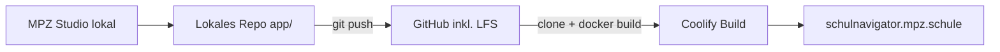

# Ist-Zustand — Medien im Git-Repo

**Stand:** 2026-06-24

## Workflow heute (vereinfacht)



## Wo landen welche Dateien?

| Inhalt | Pfad (unter `app/`) | Versionierung |
|--------|---------------------|---------------|
| Stationen-Metadaten | `data/stations.json` | Git |
| Öffentliche Medien | `public/media/{slug}/…` | Git + **LFS** (mp4, mp3, jpg, …) |
| Dialog-WAVs | `content/dialog-audio/{slug}/…` | Git + **LFS** |
| Coach-WAVs | `content/coach-audio/*.wav` | Git + **LFS** |
| Raumbilder | `public/stations/…` | Git + **LFS** |
| App-Code | `app/`, `components/`, `lib/`, … | Git |

Regeln: [`app/.gitattributes`](../../../app/.gitattributes)

## Docker-Build bindet Medien ins Image ein

Im [`Dockerfile`](../../../app/Dockerfile) (Auszug):

```dockerfile
COPY --from=builder /app/public ./public
COPY --from=builder /app/content ./content
```

`npm run build` führt `validate:stations` aus — prüft, dass alle in `stations.json` referenzierten Dateien **im Build-Kontext** existieren. Ohne Medien im Git-Clone schlägt der Coolify-Build heute fehl.

## MPZ Studio

- Schreibt direkt auf die lokale Festplatte ([ADR-022](../../adr/022-mpz-studio-internes-ingest-tool.md))
- **Kein** automatischer Git-Commit, **kein** Push
- Deploy-Tab: Validierung, QR, Token — **kein** separates Medien-Sync zum Server

Zitat Spezifikation: *„Lokal speichern → validate → `git commit` → push → Coolify“* ([`mpz-studio.md`](../../spezifikationen/mpz-studio.md))

## Problemstellung

| Beobachtung | Konsequenz |
|-------------|------------|
| `git push` nach Studio-Pflege | Schüler-Medien auf GitHub (privates Repo, ggf. LFS bei Microsoft) |
| Lokal `npm run dev` | Inhalte sichtbar **ohne** Push — verwirrt („live vs. lokal“) |
| Ein Repo für alles | Datenschutz-Anforderung „nie GitHub“ kollidiert mit MVP-Architektur |

## Was bereits passt (unverändert nutzbar)

- Hosting Live-App: Hetzner / Coolify (DE) — [ADR-001](../../adr/001-hosting-coolify.md)
- Videos nicht über YouTube — [ADR-004](../../adr/004-video-hosting-mpz.md)
- Zugangsschutz Besucher (Entry-Token, Cookie) — ADR-005/007/021
- MPZ Studio nur lokal — ADR-022
