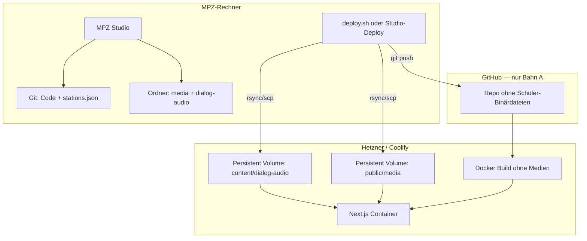

# Zielarchitektur — Zwei Bahnen

**Stand:** 2026-06-24  
**Status:** Planungsziel (Entwurf)

## Übersicht

## Bahn A — Code (GitHub + Coolify)

**Im Repo versionieren:**

- Anwendungscode (`app/`, `components/`, `lib/`, …)
- `data/stations.json` (nach DSB-Freigabe, siehe Offene Punkte)
- `data/embed-allowlist.json`, Hub-Config, Coach-**Texte** in JSON
- Statische Assets **ohne** personenbezogene Schüler-Inhalte (Brand, leere Platzhalter)
- **Hotspot-/UI-Icons (personenfrei)** liegen in `public/stations-icons/{slug}/…` — **außerhalb** jedes Bahn-B-Mounts und damit weiter in Git ¹²
- Raumbilder: **klären** — Panoramen ohne Kinder ggf. weiter in Git/LFS

**Coolify:** unverändert als Trigger für Code-Deploy (Push → Build → Run).

## Bahn B — Schüler-Medien (nur Rechner → Server)

**Nicht** in Git; Sync vom MPZ-Laptop auf den Server:

| Quelle lokal | Ziel auf Server (Volume) |
|--------------|-------------------------|
| `app/public/media/` (**gesamter** Baum, inkl. schülerbezogener Icons) | gemountet nach `/app/public/media` |
| `app/content/dialog-audio/` | gemountet nach `/app/content/dialog-audio` |
| `app/content/coach-audio/` | gemountet nach `/app/content/coach-audio` ⁶ |

**Mount-Grenze (verbindlich):** `public/media`, `content/dialog-audio` und `content/coach-audio` sind **vollständig** Bahn B. Im Container überdeckt jeder Volume-Mount den kompletten gleichnamigen Baum aus dem Image — daher dürfen **keine** git-getrackten Dateien innerhalb dieser drei Bäume liegen (nur ein `.gitkeep` für die Struktur). Personenfreie Hotspot-/UI-Icons gehören deshalb nach `public/stations-icons/` (Bahn A). ¹

**Transport:** `rsync` über SSH (empfohlen) oder vergleichbares Tool — idempotent, nur geänderte Dateien.

**Auslieferung:** Next.js `public/` (Bahn A) und API-Routen (`/api/dialog/…`, `/api/coach/…`). Bahn-B-Medien unter `/media/…` werden zur Laufzeit über [`app/media/[...path]/route.ts`](../../../app/app/media/[...path]/route.ts) aus dem Volume gestreamt (Standalone listet beim Build nur vorhandene `public/media`-Dateien).

## Docker / Coolify — technische Leitplanken

1. **Mount überdeckt das Image:** Der Volume-Mount auf `/app/public/media` (bzw. `…/dialog-audio`, `…/coach-audio`) verdeckt zur Laufzeit den kompletten gleichnamigen Baum aus dem Image. `COPY public` im Dockerfile darf bleiben, ist für diese Bäume aber irrelevant — entscheidend ist, dass dort **keine** in Git versionierten Dateien liegen, die der Mount sonst still verschwinden lässt. ¹
2. **Runtime-Mounts** in Coolify:
   - `host:/data/schulnavigator/media` → `/app/public/media`
   - `host:/data/schulnavigator/dialog-audio` → `/app/content/dialog-audio`
   - `host:/data/schulnavigator/coach-audio` → `/app/content/coach-audio` ⁶
3. **Build-Validierung — Entscheidung (statt offener Optionen):** Der Docker-/CI-Build läuft **ohne** Datei-Existenzprüfung. Dafür bekommen die beiden dateiprüfenden Validatoren je eine reine **Strukturvariante** `validate:stations:structure` und `validate:coach:structure` (Pfad-Wohlgeformtheit + JSON-Vertrag, **kein** `existsSync`), die `npm run build` aufruft. Die **vollständigen** Asset-Validatoren (`validate:stations`, `validate:coach`) laufen **lokal** in `deploy-content.sh` vor dem `rsync`. Kein `SKIP_ASSET_VALIDATE`-ENV-Flag — die getrennten Skripte machen die Build-Kette selbsterklärend und erfassen **beide** Validatoren. ⁵

## Deploy-Ablauf (Ziel-UX)

Ein Skript `scripts/deploy-with-content.sh` (Name TBD) auf dem MPZ-Rechner:

1. **Vollständige** Asset-Validatoren lokal: `npm run validate:stations` **und** `npm run validate:coach` (plus embed/hub) ⁵⁶
2. `git push` (nur wenn Code/JSON geändert)
3. `rsync` `public/media`, `content/dialog-audio` **und** `content/coach-audio` → Server-Volumes; SSH mit `-o StrictHostKeyChecking=accept-new -o ConnectTimeout=10`, **ohne** `--delete` als Default ⁶⁷⁸
4. Coolify-Redeploy auslösen (Webhook/API) **oder** nur rsync wenn reines Medien-Update ohne Code-Änderung

Optional später: Button im MPZ Studio Deploy-Tab, der dasselbe Skript aufruft (weiterhin nur `development`).

## Was sich für Redakteure nicht ändert

- MPZ Studio: Medien hochladen, Hotspots, Dialog — alles lokal
- Live-URL und Pfade (`/media/…`, `/api/dialog/…`) bleiben gleich
- Coolify bleibt der Weg für **App-Updates**

## Abgrenzung Directus (langfristig)

ADR-003 sieht Directus auf MPZ vor. Dann läge Medien-Upload direkt auf Server-Storage — GitHub-Trennung bleibt sinnvoll. Dieses Vorhaben ist **MVP-tauglich** ohne Directus.

## Änderungslog (Plan-Härtung 2026-06-24)

- ¹ Mount-Grenze verbindlich gemacht: `public/media`, `dialog-audio`, `coach-audio` vollständig Bahn B, **keine** git-getrackten Dateien darin (1a #1 / 1b #2 — Mount verdeckt Image-Baum).
- ² Personenfreie Hotspot-/UI-Icons nach `public/stations-icons/` ausgelagert statt unter `public/media/**/icons/` (1a #1 / 1b #2 — 13 reale Icon-Referenzen lägen sonst hinter dem Mount → 404).
- ⁵ Build-Validierung entschieden: dedizierte `:structure`-Varianten im Build, volle Asset-Validatoren lokal; kein `SKIP_ASSET_VALIDATE` (1b #1 / 1a #4 — `validate:stations`/`:coach` sind die Asset-Checks, Flag im Code nicht implementiert).
- ⁶ `coach-audio` als definitive Bahn B aufgenommen (Mount, rsync, Validierung) (1b #3 — war im Deploy-Vertrag offen).
- ⁷ rsync mit `StrictHostKeyChecking=accept-new` + `ConnectTimeout` festgeschrieben (1a #3 — Node/Studio hängt sonst bei unbekanntem Host-Key).
- ⁸ rsync **ohne** `--delete` als Default (T2 — Datenverlust-Risiko bei unvollständigem lokalen Stand).
