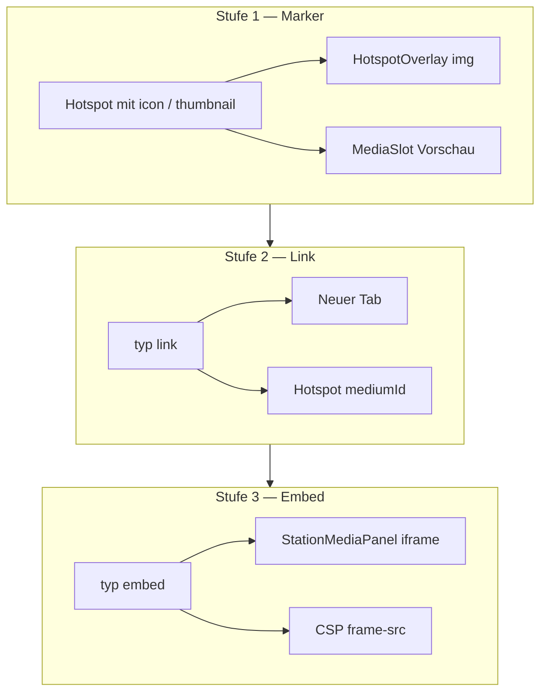

# Umsetzungsplan — Externe Medien, iframe & Hotspot-Marker

**Stand:** 2026-06-10  
**ADR:** [017 — Externe Medien, iframe-Embed und Hotspot-Marker](../adr/017-externe-medien-hotspot-marker.md)  
**Phase:** Post-Schulfest (ab Juli 2026), sukzessiv drei Stufen  
**Auslöser:** Schulwunsch Delightex (PC-Raum), externe Links, erkennbare Hotspot-Marker

---

## Zielbild



| Stufe | Nutzer sichtbar | Risiko | Aufwand (Schätzung) |
|-------|-----------------|--------|---------------------|
| 1 Hotspot-Marker | Icons statt gelber Punkt | niedrig | 1–2 PT |
| 2 `typ: link` | Externe Seite (Delightex Tab) | mittel (DSGVO Hinweis) | 1–1,5 PT |
| 3 `typ: embed` | Delightex im Panel | hoch (CSP, Mobile, DSB) | 2–3 PT |

*PT = Personentage (ein Entwickler, inkl. Tests und Doku)*

---

## Stufe 1 — Hotspot-Marker und `thumbnail`

**Ziel:** Medien-Hotspots mit Icon oder Vorschaubild; Medienliste zeigt optional Thumbnail.

### Schema (`stations.json`)

```json
{
  "medien": [
    {
      "id": "demo-video",
      "typ": "video",
      "quelle": "/media/klassenzimmer/video/grundschule_demo.mp4",
      "thumbnail": "/media/klassenzimmer/fotos/grundschule_demo.jpg",
      "untertitel": "Mein Schultag (Video)"
    }
  ],
  "hotspots": [
    {
      "id": "hs-video",
      "x": 0.45,
      "y": 0.55,
      "mediumId": "demo-video",
      "icon": "/media/klassenzimmer/icons/play.png",
      "iconSize": 0.1
    }
  ]
}
```

### Aufgaben

| # | Aufgabe | Dateien |
|---|---------|---------|
| 1.1 | Types: `Hotspot.icon?`, `Hotspot.iconSize?`, `Medium.thumbnail?` | `app/lib/types.ts` |
| 1.2 | Validator: Pfade `/…`; `iconSize` 0,05–0,25 nur bei Medien-Hotspot; `icon` verboten bei `dialog` | `app/lib/validate-stations.ts`, Tests |
| 1.3 | `resolveHotspotMarker(hs, medium, containerH)` — Fallback-Kette | `app/lib/hotspot-marker.ts` (neu) |
| 1.4 | `HotspotOverlay`: Bild-Marker + 44 px Touch-Ziel | `app/components/raum-viewer/hotspot-overlay.tsx`, Tests |
| 1.5 | Typ-Preset-Icons (SVG oder PNG unter `public/brand/hotspot-icons/`) | `public/brand/hotspot-icons/` |
| 1.6 | `MediaSlot`: `thumbnail` anzeigen | `app/components/media-slot.tsx` |
| 1.7 | Asset-Check für `icon` / `thumbnail` (optional in `validate-station-assets.mjs`) | `app/scripts/validate-station-assets.mjs` |
| 1.8 | Demo: mindestens ein Hotspot in `klassenzimmer` mit Icon | `app/data/stations.json`, Assets |
| 1.9 | Doku Redaktion | `anleitungen/content-einpflegen.md` |

### Akzeptanzkriterien

- [ ] Ohne `icon`/`thumbnail`: gelber Punkt wie bisher
- [ ] Mit `icon`: Bild skaliert mit `iconSize × effectiveDisplayH`
- [ ] Dialog-Hotspots unverändert (Maskottchen)
- [ ] `npm run test` und `npm run build` grün
- [ ] iPhone: Touch-Ziel ≥ 44 px, Gyro-Pan unverändert

### GitHub

- Epic: [#97](https://github.com/flxln/schulnavigator/issues/97)
- Stufe 1: [#98](https://github.com/flxln/schulnavigator/issues/98)

---

## Stufe 2 — `typ: link`

**Ziel:** Externe HTTPS-URLs als Medium; Hotspot und Liste öffnen neuen Tab.

### Schema

```json
{
  "id": "pc-delightex",
  "typ": "link",
  "quelle": "https://edu.delightex.com/share/…",
  "untertitel": "Unsere Delightex-Welt",
  "openIn": "external",
  "thumbnail": "/media/pc-raum/icons/delightex.png"
}
```

### Aufgaben

| # | Aufgabe | Dateien |
|---|---------|---------|
| 2.1 | `MediumTyp` um `link` erweitern; `openIn?: 'external'` | `app/lib/types.ts` |
| 2.2 | Validator: `quelle` muss `https://` sein; kein lokaler Pfad | `validate-stations.ts` |
| 2.3 | `LinkViewer`: Button „Im Browser öffnen“ + automatisch Tab bei Panel-Open (Nutzer-Geste) | `app/components/media/link-viewer.tsx` |
| 2.4 | `MediaPlayerByTyp` + `MediaSlot` Label „Link“ | `media-player-by-typ.tsx`, `media-slot.tsx` |
| 2.5 | `hotspot-overlay` Aria-Label „Link“ | `hotspot-overlay.tsx` |
| 2.6 | Kein `validate-station-assets` für `quelle` (extern) | `validate-station-assets.mjs` |
| 2.7 | PC-Raum-Station (wenn URL von Schule geliefert) | `stations.json` |
| 2.8 | Datenschutz: Kurzhinweis im Panel („Sie verlassen die App“) | `link-viewer.tsx`, ggf. `dsgvo.md` |
| 2.9 | Tests: Validator + LinkViewer | `*.test.ts(x)` |

### Akzeptanzkriterien

- [ ] Tap auf Hotspot → Panel → Link öffnet in neuem Tab (`rel=noopener`)
- [ ] Ungültige URL bricht Build ab (`validate:stations`)
- [ ] Bestehende Stationen ohne `link` unverändert

### Voraussetzung Schule

- Öffentliche Delightex-**Share-URL** (ohne Klassencode-Login), oder beliebige andere HTTPS-Zielseite

### GitHub

[#99](https://github.com/flxln/schulnavigator/issues/99)

---

## Stufe 3 — `typ: embed` (iframe)

**Ziel:** Delightex und Allowlist-Domains im Medien-Panel einbetten.

### Schema

```json
{
  "id": "pc-welt-embed",
  "typ": "embed",
  "quelle": "https://edu.delightex.com/embed/…",
  "untertitel": "Virtuelle Welt",
  "embedAllow": ["delightex.com"]
}
```

### Aufgaben

| # | Aufgabe | Dateien |
|---|---------|---------|
| 3.1 | `MediumTyp` um `embed`; Default-Allowlist Konstante | `types.ts`, `lib/embed-allowlist.ts` |
| 3.2 | Validator: HTTPS; Host muss Allowlist matchen | `validate-stations.ts` |
| 3.3 | `EmbedViewer`: responsive iframe, Sandbox-Attribute, Fehler-Fallback | `embed-viewer.tsx` |
| 3.4 | Vollbild-Toggle (optional, Mobile UX) | `embed-viewer.tsx` |
| 3.5 | CSP `frame-src` in `next.config.ts` | `next.config.ts` |
| 3.6 | Fehlerzustand: „Einbettung nicht möglich“ + Link-Fallback (`typ: link` duplizieren oder CTA) | `embed-viewer.tsx` |
| 3.7 | Tests: Allowlist, CSP-Konfiguration smoke | Tests |
| 3.8 | DSB-Freigabe dokumentieren | `dsgvo.md`, ADR-004-Verweis |
| 3.9 | Manuell: iPhone Safari + Android Chrome mit echter Delightex-URL | Testprotokoll in `lokal-testen-und-anschauen.md` |

### Akzeptanzkriterien

- [ ] Nur Allowlist-Domains im Build erlaubt
- [ ] iframe lädt in Panel auf Desktop; Mobile dokumentiert (ggf. Vollbild-Pflicht)
- [ ] Bei `X-Frame-Options`-Block: verständliche Meldung, kein leeres Panel
- [ ] **Keine** Produktions-Station mit `embed` ohne DSB-Freigabe

### Voraussetzungen

- [ ] Schule/DSB: Delightex-Einbettung freigegeben
- [ ] Delightex liefert **embed-fähige** öffentliche URL (technisch testen!)

### GitHub

[#100](https://github.com/flxln/schulnavigator/issues/100)

---

## Querschnitt (alle Stufen)

| Thema | Maßnahme |
|-------|----------|
| **Abwärtskompatibilität** | Alte JSON ohne neue Felder bleibt gültig |
| **Directus** | Felder in Collection-Design #47 vormerken |
| **Issue #50** | Nach Stufe 3: Checkboxen „externe Lernspiele“ / iframe in Phase-5-Doku abhaken |
| **Content-Autoren** | Icons 64–128 px PNG mit Transparenz; Pfad `public/media/{slug}/icons/` |

---

## Empfohlener Zeitplan

| Wann | Was |
|------|-----|
| Juli 2026 | Stufe 1 (Marker) — schneller sichtbarer Gewinn für alle Stationen |
| Juli/August | Stufe 2 — PC-Raum mit Delightex-Link |
| Nach DSB-Freigabe | Stufe 3 — iframe nur wenn Share-URL + Mobile getestet |

**Nicht parallel zum Schulfest-Content-Sprint (12.–24.06.)** — Fokus bleibt Audio/Video/Foto/Text.

---

## Checkliste vor Start Stufe 3

- [ ] Delightex-Embed-URL von Klasse 4b / PC-Raum-Lehrkraft
- [ ] Test auf Schul-WLAN und Mobilfunk
- [ ] DSB-Stellungnahme (Analog YouTube in ADR-004)
- [ ] Datenschutzerklärung App um Drittanbieter-Absatz ergänzt

---

## Verwandte Dokumente

- [ADR-017](../adr/017-externe-medien-hotspot-marker.md)
- [ADR-004 — Video-Hosting](../adr/004-video-hosting-mpz.md) (Drittanbieter-Muster)
- [ADR-006 — Raum-Viewer](../adr/006-raum-viewer-gyro-hotspots.md) (Hotspot-Koordinaten)
- [issues-phase-5.md](../github-project/issues-phase-5.md) (#50)
- [content-einpflegen.md](../../anleitungen/content-einpflegen.md)
