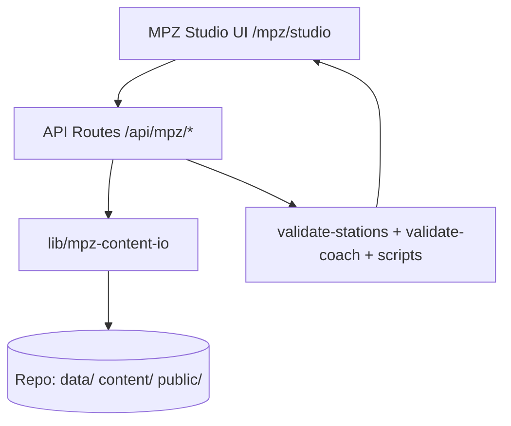
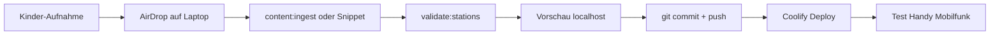

# MPZ Studio — Spezifikation (Zwischenergebnis)

**Datum:** 2026-06-16  
**Status:** geplant (Spezifikation); **Plan A umgesetzt** (CLI, Schema, Snippets)  
**Kontext:** Projekttag 24./25.06.2026, Schulfest 26.06.2026

**Projekttag-Anleitung (Plan A):** [projekttag-content-ingest.md](../../anleitungen/projekttag-content-ingest.md)  
**Claude Design (SE 13):** [mpz-studio-claude-design/](../design/mpz-studio-claude-design/README.md)

Verwandte Entscheidungen und Doku:

- [ADR-003 — Content: JSON im MVP, Directus langfristig](../adr/003-content-mvp-json-directus.md)
- [content-pflege-uebersicht.md](../content-pflege-uebersicht.md)
- [content-einpflegen.md](../../anleitungen/content-einpflegen.md)
- Issue [#47 — Directus einführen](../github-project/issues-phase-5.md) (Phase 5; Studio ist Übergangslösung für MPZ)

---

## Ausgangslage

Der MVP-Content-Workflow (Dateien in `public/` + Einträge in `stations.json`) ist für den Projekttag **fehleranfällig und träge**: Pfad-Tippfehler, doppelte Medien-IDs, Hotspot-Koordinaten per Hand, Fehler erst beim Build. **Directus** (#47) ist das richtige Zielbild für Lehrkräfte, aber für den Projekttag zu groß.

**Entscheidung:** Ein **schmales MPZ-internes Ingest-Tool** („MPZ Studio“) — nur für Felix/MPZ, nicht für die Schule. Deckt **alle** Content-Möglichkeiten ab (Stationen, Dialog, Coach, Embed-Allowlist, Brand, Hub-Konfiguration usw.).

ADR-003 bleibt gültig: Kein Lehrkräfte-Admin; Studio = Betriebs-/Projekttag-Werkzeug bis Directus live ist.

---

## Projekttag: Plan A (Pflicht) vs. Plan B (optional)

Nach Sparring (Zeitdruck 8 Tage, Single-Point-of-Failure): **Plan A ist der kritische Pfad**, MPZ Studio darf den Projekttag nicht blockieren.

| | **Plan A — Pflicht** | **Plan B — optional** |
|---|----------------------|------------------------|
| **Ziel** | Stabiler Ingest ohne neues UI | Medien-Upload + Hotspot-Kalibrierung per lokalem UI |
| **Status** | **umgesetzt** (2026-06-16) | geplant |
| **Werkzeuge** | `npm run content:ingest`, JSON-Schema, VS-Code-Snippets `sn-*`, `?hotspot-calib=1`, Git-Commit pro Station | `/mpz/studio` nur `npm run dev` auf dem Laptop |
| **Production** | Kein Schreib-Tool auf Coolify | Studio **nie** auf Coolify aktivieren |
| **Fallback** | Immer JSON + CLI | Bei Instabilität: sofort Plan A |

**Plan A — umgesetzte Artefakte:**

| Artefakt | Pfad |
|----------|------|
| Anleitung | [anleitungen/projekttag-content-ingest.md](../../anleitungen/projekttag-content-ingest.md) |
| JSON-Schema | [app/data/stations.schema.json](../../app/data/stations.schema.json) |
| Snippets | [.vscode/schulnavigator-content.code-snippets](../../.vscode/schulnavigator-content.code-snippets) |
| CLI | `npm run content:ingest` → [app/scripts/content-ingest.ts](../../app/scripts/content-ingest.ts) (IO via [lib/mpz-content-io.ts](../../app/lib/mpz-content-io.ts)) |

**Plan B — Scope (nur wenn bis ~22.06. stabil):** Medien-Upload mit korrekten Pfaden, Hotspot-Rückschreibung (Flat + Sphere). Kein Coach, Brand, Hub, Deploy-Tab vor dem 26.06.

---

## Leitplanken

| Regel | Umsetzung |
|-------|-----------|
| Nur für MPZ | Route `/mpz/*`, nur bei `NODE_ENV=development` auf dem Laptop |
| Lokal schreiben | API-Routes mit `node:fs` → Repo-Dateien; **kein** Studio auf Coolify |
| Single Source of Truth | Bestehende Validatoren nach jedem Save: `validate:stations`, `validate:coach`, `validate:tokens` |
| Deploy-Rhythmus | Lokal speichern → validate → `git commit` → push → Coolify |
| Projekttag | Plan A (CLI/JSON) ist Pflicht; Plan B (UI) ist Bonus |

**Sicherheit (Studio, Plan B):**

```ts
// Nur im Development-Build — in Production: notFound()
const enabled = process.env.NODE_ENV === 'development'
const authorized =
  request.headers.get('x-mpz-studio-key') === process.env.SN_MPZ_STUDIO_SECRET
```

**Nicht:** `SN_MPZ_STUDIO=1` auf Coolify — kein HTTP-Schreibzugriff auf `public/` in Production.

---

## Vollständige Content-Matrix (Zielbild — nicht v0)

> **Abgrenzung:** Diese Matrix beschreibt das **Zielbild der Vollversion**, nicht den v0-Schnitt. Was v0 (Plan B bis ~22.06.) tatsächlich abdeckt, steht verbindlich unter [v0 — Definition of Done](#v0--definition-of-done-plan-b). Coach, Embed-Allowlist-Extraktion, Brand, Hub, Tokens und Deploy-Tab sind **nach dem Fest** (v1/v2).

Alles aus [content-pflege-uebersicht.md](../content-pflege-uebersicht.md), im Studio abgebildet.

### A — JSON-native (direkt editierbar)

| Modul | Datei(en) | Studio-Funktion |
|-------|-----------|-----------------|
| **Stationen** | `app/data/stations.json` | Stammdaten, Viewer-Modus, alle Unterblöcke |
| **Medien** | `stations.json` + `app/public/media/{slug}/` | Upload, Typwahl, Pfade auto-generieren |
| **Hotspots Flat** | `hotspots[]` | Kalibrier-UI (neu, analog Sphere `?hotspot-calib=1`) |
| **Hotspots 360°** | `hotspots360[]` | Einbindung bestehender Sphere-Kalibrierung |
| **Dialog** | `dialog` in `stations.json` | Segmente, Gruppen, Bubble-Layout, Figuren |
| **Dialog-Audio** | `app/content/dialog-audio/{slug}/` | WAV-Upload mit Namenskonvention `01-frieda.wav` |
| **Coach** | `app/content/coach-messages.json` | CRUD aller Trigger-Typen |

### B — Dateien ohne JSON (Asset-Manager)

| Modul | Ort | Studio-Funktion |
|-------|-----|-----------------|
| **Raumbild Flat** | `app/public/stations/{slug}.jpg` | Upload + Größen-/Ratio-Hinweise (Validator) |
| **Panorama 360°** | `app/public/stations/360/{slug}.webp` | Upload; optional Button „Export-Skript starten“ |
| **Brand** | `app/public/brand/{logos,mascots,hotspot-icons,…}` | Ersetzen/Hochladen |
| **Stations-Icons (Hotspot)** | `app/public/media/{slug}/icons/` | Custom-Icons für Medien-Hotspots |

### C — Heute im Code → Config-Extraktion für Studio

Diese Bereiche stehen in der Doku unter „nur mit Code-Änderung“. Für vollständiges Studio sollten sie in editierbare Config wandern:

| Heute | Vorschlag | Studio-UI |
|-------|-----------|-----------|
| `app/lib/embed-allowlist.ts` → `DEFAULT_EMBED_ALLOW_SUFFIXES` | `app/data/embed-allowlist.json` | Globale Domains; pro Medium `embedAllow`-Subset als Checkboxen |
| `app/lib/gs39-brand-colors.ts` → Akzente | `app/data/station-accents.json` | Farbpicker pro Slug |
| `app/lib/station-icons.ts` | `app/data/station-icons.json` | Lucide-Picker oder Bild-URL |
| `app/lib/schoolhouse-hub-map.ts` → `HUB_SLUG_MAP` | `app/data/hub-slug-map.json` | Slug ↔ Slot-Dropdown (`HUB_SLOTS`-Geometrie bleibt Code) |
| `app/app/gs39-tokens.css` | bleibt CSS | Token-Editor mit Sync nach `app/scripts/reference/colors_and_type.css` |

**Embed-Allowlist:** Pro Medium in `stations.json` existiert `embedAllow` als Subset der globalen Liste. Studio: globale Liste + pro Embed-Medium Checkboxen + Live-Check (`isEmbedUrlAllowed`).

### D — Umgebung & Betrieb (Tab „Deploy“)

| Was | Studio-Aktion |
|-----|----------------|
| `NEXT_PUBLIC_EMBED_ENABLED` | Toggle in `.env.local` |
| `NEXT_PUBLIC_BASE_URL` | Anzeigen/ändern |
| QR-Codes | Button → `npm run generate:qr` |
| Token-Rotation | Button → `npm run rotate:access-tokens` (mit Dry-Run) |
| Validierung | `validate:stations` + `validate:coach` + `validate:tokens` + `test` |
| Vorschau | Links zu `/raum/{slug}`, `/eintritt?t=heft-…`, Hub |

---

## Informationsarchitektur (Navigation)

```
/mpz/studio
├── Dashboard          # Validierungsstatus, letzte Änderungen, Quick-Deploy-Hinweis
├── Stationen          # 12 Slugs als Kacheln (Hub-Nr, Viewer-Typ, Vollständigkeit)
│   └── /stationen/[slug]
│       ├── Stammdaten     (titel, beschreibung, viewer, bild, panorama360)
│       ├── Medien         (alle 6 Typen, bedingte Felder)
│       ├── Hotspots       (Flat + 360°, Kalibrierung)
│       ├── Dialog         (segmente, gruppen, bubble, Audio-Verknüpfung)
│       └── Vorschau
├── Coach              # coach-messages.json
├── Dialog-Audio       # Dateien pro Slug, fehlende Clips warnen
├── Embeds & Links     # globale Allowlist + Übersicht embed/link-Medien
├── Brand & Design     # Logos, Maskottchen, Tokens, Akzente, Hub-Icons
├── Hub-Karte          # Slug↔Slot, Slot-Geometrie read-only, Icon/Akzent
└── Deploy             # Env, QR, Token, validate-all
```

---

## Feld-Level: Stationen & Medien

### Stammdaten pro Station

| Feld | Bedeutung |
|------|-----------|
| `slug`, `titel`, `beschreibung` | Stationsseite, Hub, Liste |
| `viewer` | `flat` (Default) oder `equirectangular` (ADR-018) |
| `bild` | Flat-Panorama `/stations/{slug}.jpg` |
| `panorama360` | Sphere `/stations/360/{slug}.webp` |

### Medien (`medien[]`) — alle 6 Typen

| `typ` | Pflichtfelder im Studio | Upload/Auto |
|-------|-------------------------|-------------|
| `audio` | `id`, `untertitel`, `quelle` | → `media/{slug}/audio/` |
| `video` | `videoSource` (`upload`/`youtube`), `quelle`, optional `poster` | MP4 oder YouTube-ID |
| `foto` | `quelle` | → `fotos/` |
| `text` | `quelle` | → `texte/` (.md/.txt), optional Inline-Editor |
| `link` | `quelle` (HTTPS), `openIn`, optional `thumbnail` | URL-Validator |
| `embed` | `quelle`, `embedAllow[]` | Allowlist-Check + Hinweis `EMBED_ENABLED` |

Querschnitt: `thumbnail`, Hotspot-`icon` / `iconSize` — Verknüpfung mit Hotspot-Editor.

### Hotspots

- **Medien-Hotspot:** `mediumId` aus Dropdown der Station
- **Dialog-Hotspot:** `action: "dialog"`, `mascot`, `mascotSize`, `mascotFlipX`
- **Flat:** `x`, `y`, optional `radius`, `icon`, `iconSize` — neue Kalibrier-Route `/mpz/calib/flat/{slug}` (Klick → Koordinaten)
- **360°:** Wiederverwendung `?hotspot-calib=1` oder eingebettet mit JSON-Rückschreibung
- **Sphere-only:** `bubblePitchOffset` für Dialog-Bubbles

### Dialog (aktuell `daz`, `pc-raum`)

| Block | Inhalt |
|-------|--------|
| `figuren[]` | Checkbox Frieda/Otto |
| `segmente[]` | `id`, `rolle`, `text`, `quelle`, optional `gruppe`, `tail` |
| `gruppen[]` | Gruppentext für `beide`-Segmente |
| `bubble` | `y`, `x`, `maxWidth`, `fontSize`, `followPan` (ADR-015) |

WAV-Upload erzeugt automatisch `quelle: "/api/dialog/{slug}/01-frieda.wav"` (Konvention `DIALOG_CLIP_RE`). Warnung bei fehlender Datei.

### Coach ([ADR-019](../adr/019-coach-fortschritt-einblendung.md))

| Trigger | Zusatzfelder |
|---------|--------------|
| `hub-milestone` | `milestone` (0–12) |
| `hub-complete` | — |
| `room-first` | `slug` (Dropdown) |

Felder: `id`, `mascot` (`frieda` \| `otto` \| `duo`), `placement`, `text`, optional `modes: ["fest", "heft"]`. Validierung: `duo-split` nur bei `mascot: "duo"`.

---

## Technische Architektur



### Schicht `lib/mpz-content-io`

Kapselt Lesen/Schreiben (wiederverwendbar für Studio-UI und CLI):

- `readStations()` / `writeStations()` — pretty-printed JSON, Backup vor Write (`stations.json.bak`)
- `ingestMediumFile(slug, typ, file)` — korrekter Pfad + `medien[]`-Eintrag
- `ingestDialogClip(slug, rolle, index, file)` — WAV benennen + Segment verknüpfen
- `runValidation()` — subprocess oder importierte Validator-Logik
- Analog für Coach, Embed-Config, Hub-Config

### Projekttag-Workflow (Plan A)



Optional Plan B: Schritt C kann stattdessen **MPZ Studio lokal** sein — gleicher Pfad danach.

**Rhythmus:** Pro fertige Station committen, nicht alles am Ende. **Undo:** `git checkout -- app/data/stations.json` oder `stations.json.bak`.

---

## Voraussetzende Mini-Refactors

Ohne Config-Extraktion müsste das Studio TypeScript-Dateien patchen — fehleranfällig:

1. `app/data/embed-allowlist.json` — Loader in `embed-allowlist.ts` (einfach, reine String-Liste)
2. `app/data/station-icons.json` — Loader in `station-icons.ts`; **kein** Mini-Refactor (T1): Lucide-Komponenten sind nicht JSON-serialisierbar, JSON hält nur den Icon-**Namen**, das `name → LucideIcon`-Mapping (Name-Registry) **bleibt Code**. Aufwand ~mittel inkl. Typ + Test.
3. `app/data/hub-slug-map.json` — Loader in `schoolhouse-hub-map.ts` (`HUB_SLOTS`-Geometrie bleibt Code); der Loader **muss beim Modul-Laden werfen**, wenn ein `slotId` nicht in `HUB_SLOTS` existiert (T3).
4. `app/data/station-accents.json` — Loader in `gs39-brand-colors.ts`
5. Optional: `app/data/mpz-studio-meta.json` — letzte Edits (nur Studio, nicht Laufzeit)

> Diese Extraktionen sind **nicht v0** (Post-Fest v1/v2). Vor v0 schreibt das Studio nur `stations.json` + Asset-Dateien; die Code-Configs oben bleiben zunächst unberührt.

---

## v0 — Definition of Done (Plan B)

Abgeleitet aus zwei unabhängigen Plan-Reviews (SE-15: Codex, GLM-5.1). v0 ist **bewusst eng** geschnitten, damit Plan B den Projekttag nicht blockiert. Maßstab: **„Lokal Stationen-Content + Medien ingestieren, validieren und in der Vorschau prüfen — kein Prod-Publish, kein Git aus Studio."**

### v0-Scope — drin / draußen

| ✅ In v0 (bis ~22.06.) | ❌ Nicht v0 (Post-Fest: v1/v2) |
|---|---|
| `/mpz/studio` mit Stationen-Liste (12 Slugs) | Coach-Editor |
| Medien-Datei-Ingest: `audio`, `video` (Upload), `foto`, `text` | Embed-Allowlist-Extraktion + Editor |
| Dialog-Audio-Ingest (WAV, Namenskonvention) | Brand-/Logo-/Maskottchen-Upload |
| Bestehende Hotspot-Werte editieren **oder** Kalibrier-Snippet übernehmen (Flat + 360°) | Hub-Slug-Map-, Station-Icon-, Token-Editor |
| Vorschau-Link je Station | Deploy-Tab (QR, Token-Rotation, env-Toggles) |
| Kombinierte Struktur- **und** Asset-Validierung nach Save | Config-Extraktion nach JSON (Mini-Refactors) |

### Akzeptanzkriterien

**Funktional**

- [x] Lokale Medien-Uploads der 4 Projekttag-Typen (`audio`, `video`, `foto`, `text`) erzeugen den korrekten Pfad unter `app/public/media/{slug}/…` **und** den passenden `medien[]`-Eintrag in `stations.json`. Umgesetzt #147 (`lib/mpz-medium-ingest`, API, Mini-UI `/mpz/studio/ingest`).
- [ ] Dialog-Audio-Upload benennt die Datei nach Konvention (`01-frieda.wav`, `DIALOG_CLIP_RE`) und verknüpft das Segment (`quelle: "/api/dialog/{slug}/…"`).
- [ ] Hotspots (Flat `x`/`y` ∈ [0,1]; 360° `yaw` ∈ [-180,180], `pitch` ∈ [-90,90]) werden **schema-konform** in `stations.json` zurückgeschrieben.
- [ ] Pro Station existiert ein Vorschau-Link (`/raum/{slug}`).

**Security (Befund 2 / L4)**

- [ ] Ein zentraler Helper `assertMpzStudioAccess(request)` (in `lib/mpz-content-io` oder eigenem Modul) wird in **jeder** `/api/mpz/*`-Route aufgerufen — die Edge-Middleware deckt `/api/*` nicht ab.
- [ ] Guard-Verhalten getestet: `development` ohne Secret → 401, `development` mit gültigem Secret → ok, `production` → 404 auf `/mpz/*` **und** `/api/mpz/*`.
- [ ] `SN_MPZ_STUDIO_SECRET` nur in `.env.local`, dokumentiert in `.env.example`; **nicht** in Prod-/Coolify-Env.

**IO-Kontrakt (Befund 4)**

- [ ] `writeStations()` schreibt **atomar**: temp-Datei → `fs.rename`, vorher `stations.json.bak` aktualisieren; deterministische Key-Reihenfolge / pretty-print.
- [ ] **Rollback:** Schlägt die Validierung nach dem Save fehl, wird die vorige Version wiederhergestellt (`.bak` bzw. nicht-comitteter Stand) — keine kaputte `stations.json` bleibt liegen.
- [x] `lib/mpz-content-io` wird **vor** dem ersten UI-Edit-Feld gebaut und mit Unit-Tests abgesichert; die bestehende CLI (`content-ingest.ts`) nutzt denselben Layer (DRY) — kein verteilter `node:fs`-Zugriff in UI-Code (T2). Umgesetzt #146 (2026-06-16).

**Upload-Regeln (Befund 5)**

- [x] Pro Typ erlaubte Extensions + MIME-/Magic-Byte-Prüfung; Größenlimit; Dateinamen-Normalisierung (slug-safe); definierte Kollisionsregel (Replace vs. neuer Name). AirDrop-Dateinamen werden nie ungeprüft übernommen. Umgesetzt #147 (`lib/mpz-upload-rules.ts`, `file-type`-Sniffing).

**Validierungs-Vertrag (Befund 3)**

- [ ] Nach jedem Save laufen **beide** Ebenen: strukturelle Validierung (`validateStationsFile()` importiert) **und** das Asset-Skript (`npm run validate:stations`). Es genügt nicht, nur das npm-Skript aufzurufen.
- [ ] `validate:tokens` läuft **nicht** nach Content-Save (Access-Tokens sind inhaltlich unabhängig) — nur im späteren Deploy-Tab (L6).
- [ ] Validierung ist „Save & Validate" (Button oder debounced ≥ 800 ms), kein Subprocess-Sturm bei jedem Tastendruck (L5).

**Build / Prod**

- [ ] `NODE_ENV=production` → 404 auf `/mpz/*` und `/api/mpz/*` (manuell gegen `next build` verifiziert).
- [ ] `npm run build` bleibt grün; kein `any` in neuem Code.
- [ ] Defense-in-Depth dokumentiert/verifiziert: Prod-Image hat kein beschreibbares `data/`/`public/` für den Laufzeit-User (L3).

### Geklärte vormals offene Punkte

- **Flat-Hotspot-Kalibrierung:** eigene Route `/mpz/calib/flat/{slug}` (Klick → Koordinaten), **nicht** Erweiterung des Sphere-gebundenen `?hotspot-calib=1`. Beide Reviews empfehlen die eigene Route (U2 / Befund 6).
- **Config-Extraktion ist nicht v0.** Sie wandert nach v1/v2; Aufwand höher als „Mini-Refactor": `station-icons.ts` referenziert nicht-serialisierbare Lucide-Komponenten → Name→Component-Registry **bleibt Code** (T1); `hub-slug-map.ts`-Loader muss beim Modul-Laden prüfen, dass jeder `slotId` in `HUB_SLOTS` existiert (T3).

---

## Phasierung (Zeitplan)

| Phase | Inhalt | Zieltermin |
|-------|--------|------------|
| **Plan A — Projekttag** | CLI, JSON-Schema, Snippets, Hotspot-Kalibrierung wie heute | **erledigt** 2026-06-16 |
| **Plan B — Projekttag** | Studio v0: Medien-Upload + Hotspots (nur lokal) | optional bis ~22.06.2026 |
| **v1 — Post-Fest** | Coach, Embed-Allowlist (nach JSON-Extraktion), Brand-Uploads, Raumbilder | Juli 2026 |
| **v2 — Betrieb** | Hub-Slug-Map, Station-Icons, GS39-Tokens, Deploy-Tab (QR/Token) | August 2026 |
| **v3 — Polish** | Markdown-Editor, Dialog-Bubble-Visual-Editor, Batch-Import aus `auftraggeber/` | nach Bedarf |

**Projekttag-Minimum (v0):** Was Kinder liefern — Audio, Video, Foto, Text, ggf. Hotspots. Coach, Hub, Tokens sind am Projekttag selten zeitkritisch.

**Gesamtaufwand Vollversion:** grob 1–2 Wochen Entwicklung (nicht 2 Tage).

---

## Bewusst nicht im Scope

- **Kein Ersatz** für Pano-Export (`export-pano.mjs`, `export:pano360`) — nur als Button aufrufen
- **Kein Git-Commit** aus dem Studio — Dateien schreiben, Commit manuell
- **Kein Multi-User** — ein Laptop, ein Redakteur
- **Kein Publish auf Prod** — immer lokal → validate → commit → push → Coolify
- **Kein Lehrkräfte-Zugang** — Directus bleibt Phase-5-Ziel (#47)

---

## Directus-Vorbereitung (#47)

Studio-Module als Vorlage für spätere Directus-Collections:

| Studio-Modul | Directus (später) |
|--------------|-------------------|
| Stationen + Medien + Hotspots | `stations`, `media`, `hotspots` (Relations) |
| Dialog | `dialog_segments`, `dialog_groups` |
| Coach | `coach_messages` |
| Dialog-Audio | Files + API-Pfad-Generator |
| Embed-Allowlist | Settings / Singleton |

Nach Directus-Migration: Studio einfrieren oder nur noch für Migration/Massenimport nutzen.

---

## Nächste Schritte (Implementierung)

**Plan A:** erledigt — siehe [projekttag-content-ingest.md](../../anleitungen/projekttag-content-ingest.md).

**Plan B (Studio, optional):**

1. Guard + Route-Skeleton `/mpz/studio` (nur `development`)
2. `lib/mpz-content-io` mit `readStations` / `writeStations` + Backup
3. Stationen-Editor v0 (Medien-Upload, Hotspot-Rückschreibung)
4. Parallel: `embed-allowlist.json` extrahieren (v1)
5. API: Datei-Upload + `validate:stations` nach Save
6. Doku: Abschnitt in [fuer-entwickler.md](../../anleitungen/fuer-entwickler.md) wenn v0 steht

---

## Offene Punkte

- [x] ADR für MPZ Studio (internes Tool vs. ADR-003 „kein Custom-Admin“) — entschieden als eigener [ADR-022](../adr/022-mpz-studio-internes-ingest-tool.md) (Status: entschieden, 2026-06-16); ADR-003 mit Cross-Link „ergänzt durch ADR-022“ markiert
- [x] Flat-Hotspot-Kalibrierung: **eigene Route `/mpz/calib/flat/{slug}`** (SE-15 U2/Befund 6) — siehe [v0 — Definition of Done](#v0--definition-of-done-plan-b)
- [ ] `SN_MPZ_STUDIO_SECRET` in `.env.example` dokumentieren (nur wenn Plan B umgesetzt)
- [x] Plan A: JSON-Schema, Snippets, `content:ingest` (2026-06-16)
- [x] v0-DoD + Akzeptanzkriterien aus SE-15-Reviews (Codex, GLM-5.1) eingearbeitet (2026-06-16)
