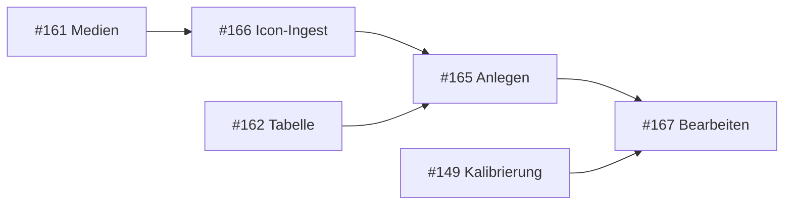

# MPZ Studio — Hotspot-Editor (Anlegen, Grafik, Koordinaten)

**Stand:** 2026-06-17 · **Epic:** [#158](https://github.com/flxln/schulnavigator/issues/158) · **Branch:** `mpz-studio-v1`  
**Vorgänger:** [#162](https://github.com/flxln/schulnavigator/issues/162) (Tabelle, Kalibrier-Links, Entfernen)  
**Unterissues:** [#165](https://github.com/flxln/schulnavigator/issues/165) Anlegen · [#166](https://github.com/flxln/schulnavigator/issues/166) Icon-Ingest · [#167](https://github.com/flxln/schulnavigator/issues/167) Bearbeiten

---

## Ziel

MPZ kann **Medien-Hotspots** ohne JSON-Editor vollständig pflegen: anlegen mit **Koordinaten**, **Hotspot-Grafik** (`icon`) und **Darstellungsgröße** (`iconSize`), Icons **hochladen**, bestehende Hotspots **bearbeiten**. Dialog-Hotspots (`action: dialog`) bleiben außerhalb dieses Schnitts (eigenes Thema / `station.dialog`).

**User Story (Flat/Sphere):**

1. Medium ingestieren ([#161](https://github.com/flxln/schulnavigator/issues/161))
2. Optional: Hotspot-Icon hochladen ([#166](https://github.com/flxln/schulnavigator/issues/166))
3. Hotspot anlegen mit Medium, Position und Grafik ([#165](https://github.com/flxln/schulnavigator/issues/165))
4. Feinjustierung per Kalibrier-UI (v0 [#149](https://github.com/flxln/schulnavigator/issues/149)) oder Formular ([#167](https://github.com/flxln/schulnavigator/issues/167))
5. Save & Validate (v0 [#150](https://github.com/flxln/schulnavigator/issues/150))

---

## Datenmodell (Medien-Hotspot)

Quelle: [`app/lib/types.ts`](../../app/lib/types.ts), Validator [`validate-stations.ts`](../../app/lib/validate-stations.ts), [ADR-017](../adr/017-externe-medien-hotspot-marker.md).

### Flat (`hotspots[]`, `viewer: flat`)

| Feld | Pflicht | Bereich / Regel |
|------|---------|-----------------|
| `id` | ja | Eindeutig pro Station; Empfehlung `hs-…`, Regex `^[a-z0-9][a-z0-9-]*$` |
| `label` | nein | Anzeigename |
| `mediumId` | ja | Muss in `station.medien[].id` existieren |
| `x`, `y` | ja | `0`–`1` (Bildkoordinaten) |
| `icon` | nein | Pfad mit `/`, typ. `/media/{slug}/icons/….svg` |
| `iconSize` | nein | `0.05`–`0.25` (Anteil Anzeigehöhe); Konstanten in [`raum-viewer/constants.ts`](../../app/lib/raum-viewer/constants.ts) |
| `radius` | nein | v1-Editor: **nicht** im UI (Fallback Viewer) |

### Sphere (`hotspots360[]`, `viewer: equirectangular`)

| Feld | Pflicht | Bereich / Regel |
|------|---------|-----------------|
| `id`, `label`, `mediumId` | wie Flat | |
| `yaw`, `pitch` | ja | `yaw` −180…180, `pitch` −90…90 |
| `icon`, `iconSize` | nein | wie Flat |

**Ohne `icon`:** Renderer nutzt `thumbnail` des Mediums → Typ-Preset → gelber Punkt ([ADR-017](../adr/017-externe-medien-hotspot-marker.md) Stufe 1).

### Dateiablage Hotspot-Grafik

| Ort | Zweck |
|-----|--------|
| `app/public/media/{slug}/icons/` | Stations-Hotspot-Icons (SVG, PNG, WebP) |
| Beispiele im Repo | `klassenzimmer/icons/play.svg`, `pc-raum/icons/delightex.svg` |

`icon` in JSON ist **nur der öffentliche Pfad** (`/media/…`), kein Upload in #165 selbst — Upload kommt über [#166](https://github.com/flxln/schulnavigator/issues/166).

---

## Issue-Schnitt

| Issue | Lieferumfang | API (geplant) |
|-------|----------------|---------------|
| **#165** | Formular „Hotspot hinzufügen“: `id`, `label`, `mediumId`, Koordinaten, `icon` (Picker), `iconSize` | `POST /api/mpz/stations/[slug]/hotspots` |
| **#166** | Icon-Datei nach `public/media/{slug}/icons/`; Liste für Picker; MIME SVG/PNG/WebP | `POST /api/mpz/hotspots/icon` oder Erweiterung Ingest |
| **#167** | Zeile „Bearbeiten“: gleiche Felder außer `id`; Kalibrier-Link bleibt | `PATCH /api/mpz/stations/[slug]/hotspots/[hotspotId]` |

**Abhängigkeiten:** #165 benötigt #161, #162. #166 kann parallel zu #165 starten; #165-UI nutzt #166 für Upload + Dateiliste. #167 nach #165.

---

## UI — Tab Hotspots (S7)

Erweiterung von [`station-hotspots-table.tsx`](../../app/components/mpz-studio/station-hotspots-table.tsx).

### Block A — Hotspot hinzufügen (#165)

- Sichtbar wenn `station.medien.length > 0`, sonst Link zu Ingest
- **Flat:** Felder `x`, `y` (Zahl, 4 Dezimalen, 0–1); Default `0.5` / `0.5`
- **Sphere:** `yaw`, `pitch` (Grad); Default `0` / `0`
- **Grafik:** Dropdown „Icon“ — Einträge: *(keins)*, vorhandene Dateien unter `/media/{slug}/icons/`, Button „Icon hochladen…“ (#166)
- **iconSize:** Slider oder Zahl `0.05`–`0.25`, Default `0.2` (wie Demo-Stationen)
- Submit → POST → Erfolg: Tabelle aktualisieren, optional Hinweis Kalibrierung

### Block B — Icon hochladen (#166)

- Modal oder Inline neben Icon-Picker
- Akzeptiert `.svg`, `.png`, `.webp`; Ziel `public/media/{slug}/icons/{dateiname}`
- Kollision: Bestätigung überschreiben oder Fehler
- Nach Upload: Picker aktualisieren, Pfad in Formular übernehmen

### Block C — Zeile bearbeiten (#167)

- Aktion „Bearbeiten“ neben „Entfernen“
- Inline-Panel oder kleines Modal: `label`, `mediumId`, Koordinaten, `icon`, `iconSize`
- `id` read-only
- PATCH → dirty + validate + refresh

**Nicht in v1-Editor:** Dialog-Hotspots, `radius`, `bubblePitchOffset`, Massenimport JSON.

---

## Domain & Validierung

Erweiterung [`mpz-station-hotspots.ts`](../../app/lib/mpz-station-hotspots.ts) (symmetrisch zu `removeStationHotspot`):

### `addStationHotspot` (#165)

Fehlercodes (vor `writeStations`): `NOT_FOUND`, `DUPLICATE_ID`, `MEDIUM_NOT_FOUND`, `NO_MEDIAS`, `INVALID_ID`, `INVALID_COORDS`, `INVALID_ICON`, `INVALID_ICON_SIZE`

- Koordinaten gegen Validator-Grenzen prüfen (nicht nur HTML `min`/`max`)
- `icon`: wenn gesetzt, Pfad muss mit `/media/{slug}/` beginnen; optional `postValidate` / Asset-Check bei Save & Validate
- `iconSize`: clamp auf `MIN_ICON_SIZE_NORM`…`MAX_ICON_SIZE_NORM`

### `patchStationHotspot` (#167)

- `hotspotId` unveränderlich
- Partielles Patch-Objekt; mindestens ein Feld
- Gleiche Validierung wie Anlegen für gesetzte Felder

### Icon-Ingest (#166)

- Analog [`mpz-medium-ingest.ts`](../../app/lib/mpz-medium-ingest.ts): `withMpzWriteLock`, nur unter `public/media/{slug}/icons/`
- Kein Eintrag in `medien[]` — nur Datei + Rückgabe `{ path: "/media/{slug}/icons/…" }`

---

## Risiken

| Risiko | Mitigation |
|--------|------------|
| Flat-`y` außerhalb sichtbarem Ausschnitt | Hinweis im Formular (mittleres Drittel); `validate:stations`-Warnung bleibt |
| Icon-Pfad zeigt auf fehlende Datei | Save & Validate / `postValidate`; Picker nur existierende Dateien (#166) |
| Geteiltes Icon (`pc-raum` delightex.svg) | Entfernen/Bearbeiten ändert nur JSON-Referenz, nicht Datei — wie #161 |
| Koordinaten doppelt (Formular + Kalibrierung) | Bearbeiten (#167) und Kalibrierung (#149) schreiben dieselben Felder; letzter Write gewinnt |

---

## Verweise

- [epic-mpz-studio-v1.md](../github-project/epic-mpz-studio-v1.md)
- [content-einpflegen.md](../../anleitungen/content-einpflegen.md) § Hotspots, Hotspot-Icons
- [02-v0-screens-und-user-stories.md](../design/mpz-studio-claude-design/02-v0-screens-und-user-stories.md) § S7–S8
- Implementierungsplan Cursor: [`.cursor/plans/mpz_studio_#165_8f3a2c1d.plan.md`](../../.cursor/plans/mpz_studio_#165_8f3a2c1d.plan.md) (wird an diese Spec angeglichen)
